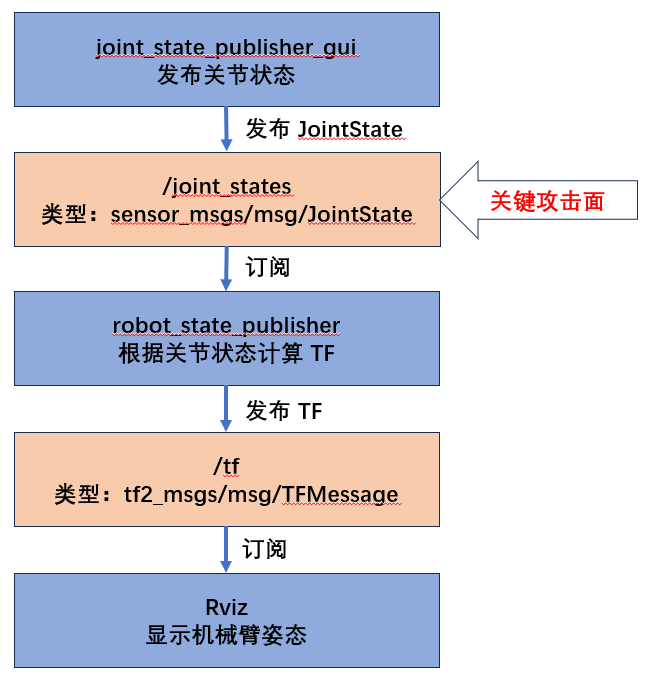
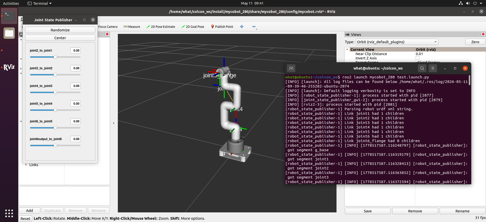
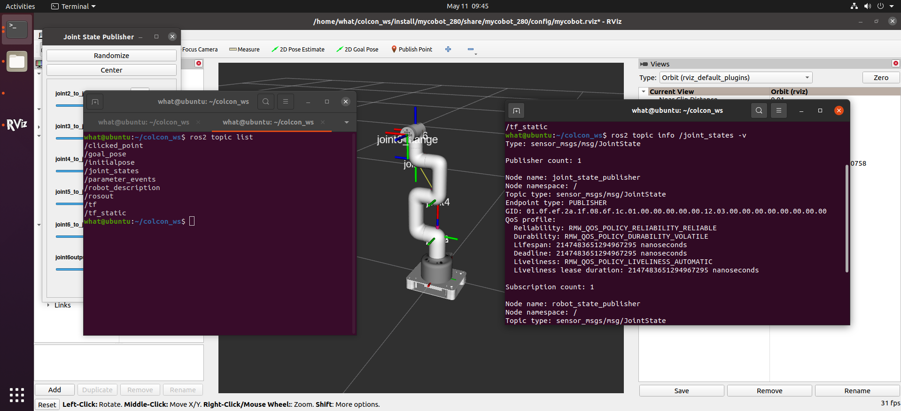
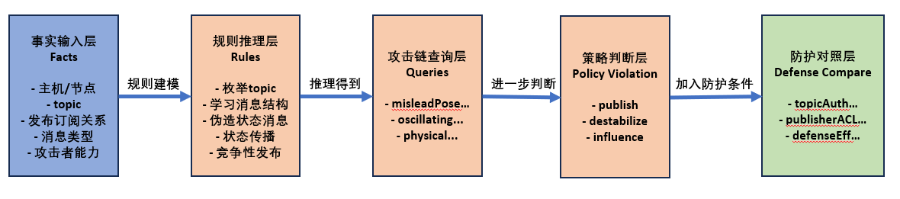
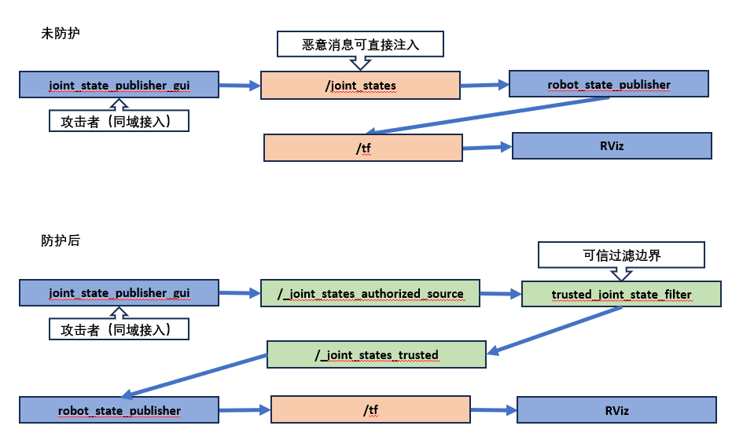
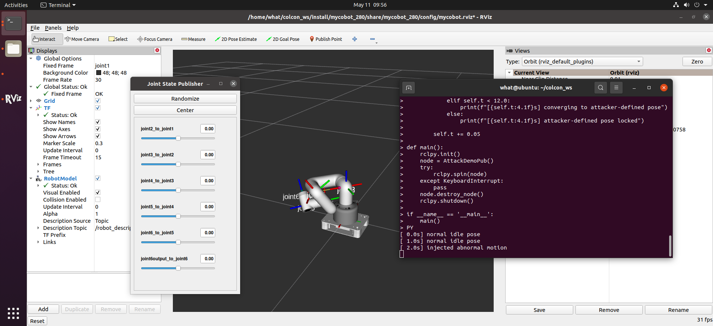
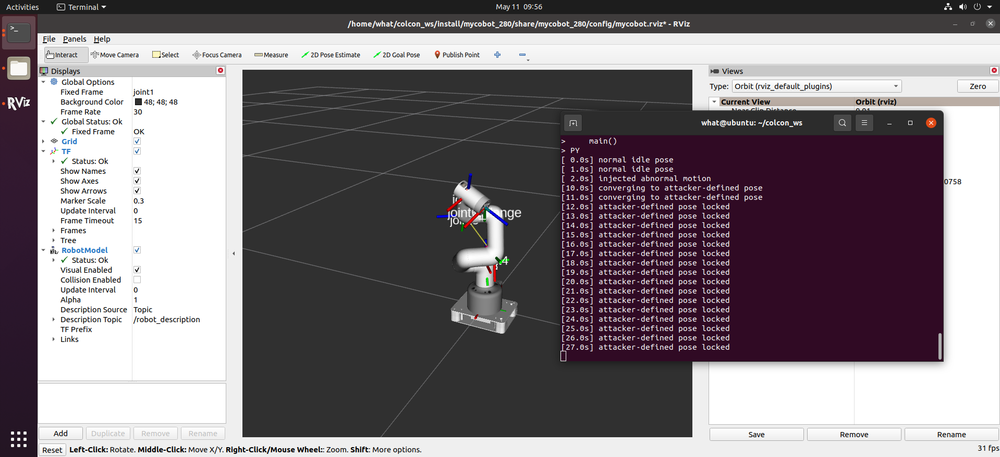

# 面向智能机器人的漏洞挖掘与自动化攻击路径推理

## 摘要

随着机器人系统开放性和互联性不断增强，ROS2 环境中的状态发布链路也暴露出更明显的安全风险。本文以 myCobot-280 机械臂为对象，围绕 `JointState` 状态链开展研究，结合虚拟仿真、XSB 规则推理和代码级验证，复现了消息伪造导致的显示层状态欺骗，以及合法 publisher 与恶意 publisher 并存时的状态振荡现象。在此基础上，本文借鉴 MulVAL 的建模思想，对攻击条件、攻击过程和策略违规结果进行形式化描述，并实现了一套面向 `JointState` 链路的最小应用层防护方案。实验结果表明，未加防护时，攻击者可通过构造语义合法且时间戳有效的关节状态消息影响 RViz 姿态显示；加入防护后，系统能够识别并拒绝竞争性异常输入，从而有效切断本文复现出的核心攻击路径。本文为智能机器人场景下的攻击路径分析与轻量级防护验证提供了一个可复现的研究样例。

**关键词：** 智能机器人安全；ROS2；myCobot；攻击路径推理；XSB；JointState；应用层防护

---

## 1. 引言

### 1.1 研究背景

智能机器人系统正在广泛应用于制造、教育、科研与服务等场景。随着 ROS/ROS2、MoveIt 等开源框架的普及，机器人控制系统的开放性、模块化与可扩展性显著增强，但同时也引入了更多网络通信链路、组件依赖关系与潜在攻击入口。尤其在 ROS2 分布式节点架构下，控制、感知、状态发布、可视化与执行层之间存在大量基于 topic、service 与 action 的交互，一旦其中某一链路缺乏身份鉴别、权限控制或输入校验，攻击者便可能利用消息注入、权限提升或链路劫持等方式影响系统行为。

从开题与中期阶段的工作来看，项目原始目标聚焦于面向智能机器人的漏洞分析、攻击路径推理与实验验证，强调从代码漏洞与通信弱点出发，逐步过渡到系统层与物理行为层的风险分析。结合当前研究进展，本文进一步将研究问题收敛到一个更可验证、也更适合结项阶段展开的核心场景：在 ROS2 环境下，围绕机械臂 `JointState` 状态链路，研究消息伪造与竞争性发布所带来的安全风险，并尝试给出规则推理与代码实现层面的对应防护方案。

### 1.2 研究目的与意义

本文的研究目的主要包括以下三个方面：

1. 面向 myCobot-280 机械臂场景，分析 ROS2 状态发布链路中的潜在安全风险，并识别可被实验验证的攻击入口。
2. 结合 XSB 与 MulVAL 风格建模方法，对攻击条件、攻击步骤与策略违规关系进行形式化描述，验证自动化攻击路径推理在机器人场景下的可行性。
3. 针对已复现的攻击场景，设计并实现一套轻量级应用层防护机制，评估其在抑制异常消息注入与竞争性发布方面的有效性。

该研究有助于把机器人系统安全分析从“能运行”推进到“可解释、可建模、可验证”，对后续的可信控制与安全评估工作具有参考价值。

### 1.3 本文主要工作

本文围绕结项阶段已经完成的实验与建模工作，主要完成了以下内容：

1. 搭建并梳理了 myCobot-280 在 ROS2 虚拟环境中的基础显示链路，明确了 `joint_state_publisher`、`robot_state_publisher` 与 RViz 之间的数据流关系。
2. 复现了基于 `JointState` 伪造的显示层状态欺骗，以及合法发布者与恶意发布者并存时的竞争性状态振荡现象。
3. 基于 XSB 构建了攻击版与防护版规则模型，用于解释攻击链成立条件、策略违规结果及防护后攻击链失效的逻辑原因。
4. 在代码层实现了基于可信 topic 转发、时间戳校验、关节名与范围校验、发布者数量检查的最小应用层防护原型，并完成运行时验证。

为提高研究过程的可复查性与成果共享程度，本文相关报告草稿、XSB 规则文件、实验记录以及与防护方案直接相关的代码快照已整理并公开于 GitHub 仓库：`https://github.com/Eitr-SphinSaure/mycobot_280_srtp`。

### 1.4 论文结构

本文后续章节安排如下：第二章介绍研究对象、实验环境与相关技术基础；第三章分析系统场景与攻击面；第四章给出基于 XSB 的攻击路径推理建模；第五章介绍攻击实验的设计与实现；第六章介绍防护方案的设计与实现；第七章给出实验结果与分析；第八章总结全文并讨论后续工作。

---

## 2. 研究对象、实验环境与相关技术基础

### 2.1 研究对象概述

本文的研究对象为大象机器人 myCobot-280-arduino 机械臂平台。该平台属于轻量级六自由度桌面机械臂，具有结构清晰、接口开放、社区资料相对丰富等特点，适合用于 ROS2 通信链路分析、消息交互验证与攻击路径推理实验。在本研究中，实机部分的硬件组合包括 myCobot-280-arduino 本体与 MEGA R3 2560 开发板；虚拟实验部分则围绕 ROS2 环境中的机械臂模型、关节状态发布链路与可视化组件展开。

从系统组成上看，本文重点关注以下几个层次：

1. **机械臂对象层。** 包括 myCobot-280-arduino 机械臂本体、其关节结构以及实际控制接口。
2. **ROS2 中间件层。** 包括 topic 发布与订阅、节点发现、消息传输与状态广播等通信机制。
3. **显示与状态更新层。** 包括 `joint_state_publisher`、`robot_state_publisher` 与 RViz 所构成的关节状态显示链。
4. **规则推理与建模层。** 包括 XSB 与 MulVAL 风格的攻击路径推理建模，用于解释实验中观察到的攻击条件、攻击步骤和策略违规关系。

需要说明的是，本文虽然以“面向智能机器人的漏洞挖掘与自动化攻击路径推理”为总体方向，但结项阶段的研究重点被进一步收敛到一个可复现、可建模且可防护验证的核心链路，即围绕 `JointState` 消息流的状态欺骗、竞争性发布与应用层防护问题。因此，本文并不追求对整个机器人控制系统进行全面覆盖，而是聚焦于一个能够代表 ROS2 机器人系统中典型信任风险的最小实验闭环。

|||
|:---:|:---:|
| (a) 实机平台与仿真模型 | (b) 开发板 |

<center>图 2-1 研究对象与实验对象图组。</center>

### 2.2 实验环境配置

#### 2.2.1 硬件与宿主环境

本研究的宿主开发环境采用 Ubuntu 24.04 LTS，主要用于文档整理、代码编写、工作区维护以及与虚拟实验环境之间的协同操作。实机平台采用 myCobot-280-arduino 机械臂，并配套使用 MEGA R3 2560 开发板，用于后续与机械臂控制链相关的程序适配与接口验证。

考虑到结项阶段的重点在于攻击链复现与规则推理验证，本文将实验主战场放在虚拟机环境中完成。其原因主要有两点：一是虚拟环境更便于快速观察 `JointState`、`tf` 与 RViz 姿态变化之间的关系；二是状态显示链路中的攻击与防护验证可以在较低风险下反复复现，从而更适合形成稳定的实验记录。实机部分在本阶段主要承担平台确认与后续扩展的作用，而不作为本次结项的唯一核心验证路径。

#### 2.2.2 软件与依赖环境

本研究的软件环境分为宿主侧环境与虚拟实验环境两部分：

1. **宿主侧开发环境。**
   - 操作系统：Ubuntu 24.04 LTS
   - Python 版本：Python 3.12
   - 规则推理工具：XSB 5.0

2. **虚拟实验环境。**
   - 操作系统：Ubuntu 20.04
   - ROS2 发行版：ROS2 Foxy
   - 主要组件：RViz、`joint_state_publisher`、`robot_state_publisher`

采用上述双环境结构的原因在于：一方面，宿主侧环境适合进行规则建模、文档整理与代码开发；另一方面，已有的机械臂 ROS2 虚拟环境与 `mycobot_ros2` 工作区在 Ubuntu 20.04 与 ROS2 Foxy 下能够稳定运行，便于复现中期以来的实验基础。虽然结项期间也曾尝试搭建 Ubuntu 22.04 与 ROS2 Humble 环境以推进 MoveIt2 相关控制链验证，但由于时间成本和版本适配问题，该增强路径最终未纳入本次结项主线。

从工程组织形式看，本文主要围绕一个 ROS2 工作区 `colcon_ws` 展开。该工作区中包含与 myCobot 相关的 ROS2 功能包、仿真与显示链配置、桥接控制脚本以及后续引入的应用层防护逻辑。除 ROS2 工作区外，本文还维护了独立的 XSB 规则文件与实验记录文件，用于支撑攻击版与防护版推理模型的复现和对照分析。

|类别|组件名称|版本/型号|作用说明|
|:---:|:---:|:---:|:---:|
|宿主侧|宿主操作系统|Ubuntu 24.04 LTS|提供开发、建模与文档整理环境|
|虚拟机侧|虚拟机操作系统|Ubuntu 20.04|提供 ROS2 实验环境|
|虚拟机侧|ROS2 发行版|Foxy|支撑机械臂显示链的 ROS2 环境|
|宿主侧|Python|3.12|用于编写攻击脚本与防护逻辑|
|宿主侧|XSB|5.0|用于攻击路径推理建模|
|硬件|myCobot-280-arduino|机械臂平台|提供实际机械臂对象与接口|
|硬件|MEGA R3 2560|开发板|用于与机械臂控制链的接口适配|
|工程组织|`colcon_ws`|ROS2 工作区|组织 ROS2 功能包、仿真配置与防护代码|

<center>表 2-1 实验环境配置表。</center>

#### 2.2.3 虚拟环境中的 ROS2 显示链

在虚拟实验环境中，本文首先使用 `ros2 launch mycobot_280 test.launch.py` 启动机械臂显示链。实验表明，该启动链路的核心节点主要包括 `joint_state_publisher`（或 `joint_state_publisher_gui`）、`robot_state_publisher` 与 RViz。其基本工作方式可以概括为：

`joint_state_publisher -> /joint_states -> robot_state_publisher -> /tf -> RViz`

其中，`joint_state_publisher` 负责发布关节状态消息，`robot_state_publisher` 根据机器人描述模型与关节角信息计算坐标变换，并通过 `/tf` 与 `/tf_static` 对外广播机械臂姿态，RViz 则根据这些消息完成模型可视化显示。

在前期实验中，通过 `ros2 topic list`、`ros2 topic list -t` 与 `ros2 topic info /joint_states -v` 等命令可以确认：

- `/joint_states` 的消息类型为 `sensor_msgs/msg/JointState`；
- `/joint_states` 的发布者为 `joint_state_publisher`；
- `/joint_states` 的订阅者为 `robot_state_publisher`；
- RViz 通过 TF 链路间接反映关节状态变化。

这一显示链是后续攻击与防护实验的基础。未加防护时，攻击者如果能够向状态链路中注入伪造的 `JointState` 消息，就有可能影响 RViz 中机械臂的姿态显示；而在后续防护实现中，本文进一步通过“原始 topic + 可信 topic + 过滤节点”的方式对该链路进行了重构。



<center>图 2-2 ROS2 显示链结构图</center>

|||
|:---:|:---:|
| (a) RViz 运行界面 | (b) `/joint_states` 相关终端输出 |

<center>图 2-3 ROS2 虚拟环境运行界面图组。</center>

### 2.3 相关技术基础

#### 2.3.1 ROS2 通信机制简介

ROS2 是面向机器人系统的分布式软件框架，其通信机制以 DDS（Data Distribution Service）为底层基础，支持节点间通过 topic、service 与 action 进行解耦交互。与本研究直接相关的，是基于 topic 的发布/订阅模式。

在 ROS2 中，**publisher** 用于向指定 topic 发布消息，**subscriber** 用于从同名 topic 接收消息。消息以预定义的数据结构表示，不同 topic 绑定不同的消息类型。以本研究为例，`/joint_states` 对应的消息类型为 `sensor_msgs/msg/JointState`，用于表达一组关节在某一时刻的状态信息。

ROS2 的一个重要特征是分布式发现机制。处于同一 ROS2 域内的节点可以自动发现彼此公开的 topic 与服务接口，这一机制提升了系统扩展性与开发效率，但也意味着如果缺乏额外的身份认证与访问控制，攻击者可能通过 topic 枚举、消息类型学习与合法格式构造等方式，对系统链路进行探测和干预。因此，在开放互联条件下，通信便利性与安全可控性之间存在明显张力，这也是本文选择 `JointState` 链路作为研究入口的重要原因之一。

#### 2.3.2 `JointState` 消息与机械臂姿态更新机制

`sensor_msgs/msg/JointState` 是 ROS2 中用于描述关节状态的标准消息类型，其核心字段包括：

- `header`：消息头，其中包含时间戳等元数据；
- `name`：关节名称数组；
- `position`：关节位置数组；
- `velocity`：关节速度数组；
- `effort`：关节受力或力矩数组。

该消息的一个基本约束是：`name`、`position`、`velocity` 与 `effort` 等数组在语义上应保持对应关系，关节状态的时间戳应能够反映消息的时效性。在本文实验中，初期直接使用 `ros2 topic pub` 注入 `/joint_states` 虽然能够修改 topic 中的 `position` 值，但由于时间戳无效，RViz 中的机械臂姿态并未随之更新；只有在 Python publisher 中显式写入当前时间戳后，伪造消息才成功影响显示结果。这一现象表明，时间戳有效性是 `JointState` 链路中的关键条件之一。

在 myCobot-280 场景下，实验中涉及的关节名称主要包括：

- `joint2_to_joint1`
- `joint3_to_joint2`
- `joint4_to_joint3`
- `joint5_to_joint4`
- `joint6_to_joint5`
- `joint6output_to_joint6`

相应的关节位置范围以弧度表示，可简化整理如下：

- `joint2_to_joint1`：`[-2.9322, 2.9322]`
- `joint3_to_joint2`：`[-2.3562, 2.3562]`
- `joint4_to_joint3`：`[-2.6180, 2.6180]`
- `joint5_to_joint4`：`[-2.5307, 2.5307]`
- `joint6_to_joint5`：`[-2.8798, 2.8798]`
- `joint6output_to_joint6`：`[-3.14159, 3.14159]`

在正常情况下，`robot_state_publisher` 根据这些关节名和关节角计算变换关系，并更新 RViz 中的机械臂姿态；在攻击实验中，攻击者也正是通过构造名称匹配、范围合法且时间戳有效的 `JointState` 消息，才成功完成显示层状态欺骗。

|字段名|数据含义|安全作用|非法时可能造成的问题|
|:---:|:---:|:---:|:---:|
|`header.stamp`|时间戳|确保消息的时效性|时间戳无效可能导致消息被忽略或错误处理|
|`name`|关节名称数组|验证消息的完整性|非法名称可能导致消息被拒绝或错误处理|
|`position`|关节位置数组|控制机械臂姿态|非法位置可能导致机械臂姿态异常或损坏|
|`velocity`|关节速度数组|反映机械臂运动状态|非法速度可能导致机械臂运动异常或安全风险|
|`effort`|关节受力或力矩数组|评估机械臂负载情况|非法 effort 可能导致机械臂过载或损坏|

<center>表 2-2 `JointState` 关键字段与约束说明表。</center>

|关节名称|最小值（rad）|最大值（rad）|
|:---:|:---:|:---:|
|`joint2_to_joint1`|`-2.9322`|`2.9322`|
|`joint3_to_joint2`|`-2.3562`|`2.3562`|
|`joint4_to_joint3`|`-2.6180`|`2.6180`|
|`joint5_to_joint4`|`-2.5307`|`2.5307`|
|`joint6_to_joint5`|`-2.8798`|`2.8798`|
|`joint6output_to_joint6`|`-3.14159`|`3.14159`|

<center>表 2-3 myCobot-280 关节名称与关节范围表。</center>

#### 2.3.3 XSB 与 MulVAL 风格攻击路径推理

XSB 是支持表格化求值（tabling）的逻辑推理系统，适合用于基于规则的安全建模与攻击路径推理。MulVAL 则是一类典型的基于 Datalog 的攻击图分析框架，其基本思想是：将系统状态、网络访问关系、漏洞条件、攻击者能力与安全策略等信息抽象为事实与规则，然后通过自动推理得到攻击路径或策略违规结果。

在本文中，XSB 与 MulVAL 风格建模主要用于完成以下工作：

1. **事实建模。** 将 ROS2 场景中的 topic、消息类型、发布/订阅关系、攻击者能力与下游信任关系抽象为基础事实。
2. **规则推理。** 定义“攻击者枚举 topic”“学习消息结构”“构造合法伪造消息”“误导 TF 流”“造成显示层状态欺骗”“形成竞争性 publisher 振荡”等推理规则。
3. **策略违规检测。** 通过 `policyViolation(...)` 等规则判断攻击结果是否构成对系统策略的违反。
4. **防护对照分析。** 在防护版规则模型中引入认证、访问控制与单一权威 publisher 等条件，观察攻击链在何处被截断。

与单纯的 yes/no 演示不同，XSB 的优势在于其不仅能够给出某条结论是否成立，还可以配合 `spy(...)` 等方式展示推理路径，从而把实验现象与规则逻辑一一对应起来。对于本研究而言，这种能力非常重要，因为它使得“消息伪造为什么能成立”“竞争性 publisher 为什么会导致振荡”“防护为什么会使攻击链失效”等问题都能够在形式化规则层面得到解释，而不是停留在经验性观察上。



<center>图 2-4 XSB / MulVAL 风格推理流程图</center>

---

## 3. 系统场景分析与威胁模型

### 3.1 系统场景描述

本文研究的系统场景建立在 ROS2 虚拟实验环境之上，其核心目标不是完整复刻工业现场中的所有控制链，而是围绕 myCobot-280 的关节状态显示链，构造一个能够稳定复现、便于观察且适合推理建模的最小实验系统。该系统的关键参与节点包括：

1. `joint_state_publisher` 或 `joint_state_publisher_gui`，用于发布机械臂各关节的状态信息；
2. `robot_state_publisher`，用于根据关节状态与机器人描述模型计算坐标变换；
3. RViz，用于可视化显示机械臂模型姿态；
4. 在扩展场景中，可能存在进一步消费关节状态信息的桥接节点，例如将状态消息映射为实机动作的控制脚本。

在未加防护的基础场景下，系统的核心消息流可简化表示为：

`joint_state_publisher -> /joint_states -> robot_state_publisher -> /tf -> RViz`

在该链路中，`/joint_states` 扮演了一个极为关键的角色：它既是关节状态信息的主要输入通道，也是后续姿态显示和可能的下游控制逻辑的上游来源。实验表明，`robot_state_publisher` 默认只关心接收到的 `JointState` 消息是否满足其基本处理条件，而不会进一步判断该消息来自哪个发布者、是否具有授权身份、是否与当前系统中的其他消息源冲突。因此，只要攻击者能够进入同一 ROS2 域，并成功构造语义上足够真实的 `JointState` 消息，便有机会影响整条显示链。

在加入防护后的代码实现中，本文又将该场景重构为：

`/_joint_states_authorized_source -> trusted_joint_state_filter -> /_joint_states_trusted -> robot_state_publisher -> /tf -> RViz`

此时，原始输入与可信输入被显式分层，`robot_state_publisher` 不再直接消费裸露的原始状态消息，而是仅信任经过过滤与校验后的可信 topic。这一变化为后续防护实验与规则建模中的“攻击链被截断”提供了明确的工程对应物。



<center>图 3-1 系统场景与信任边界</center>

### 3.2 攻击面分析

#### 3.2.1 原始 `JointState` 链路的信任假设

原始 `JointState` 链路之所以构成风险，根源在于系统默认采用了较强的“消息即信任”假设。在未加防护的场景下，只要某个节点能够向 `/joint_states` 发布格式正确的消息，`robot_state_publisher` 就会尝试根据该消息更新坐标变换，RViz 也会据此刷新机械臂姿态。换言之，系统对消息内容的处理更多依赖于**消息结构是否合法**，而不是**消息来源是否可信**。

这种设计在教学、开发与调试场景下具有明显便利性，但从安全视角来看，其隐含了至少三层信任假设：

1. `/joint_states` 上的发布者默认是善意且唯一的；
2. 发布者给出的关节名称、角度范围与时间戳默认可信；
3. 下游节点可以直接消费该 topic，而无需额外的身份校验、访问控制或多源仲裁。

一旦上述假设被打破，攻击者便可能通过同域接入、topic 枚举和合法格式构造等方式，对状态链进行直接干预。因此，裸露的 `JointState` 输入在本研究场景中不是一个简单的“状态反馈接口”，而是一个兼具高影响力与弱鉴别性的关键攻击面。

|信任假设|正常情况下的作用|被打破后的风险后果|
|:---:|:---:|:---:|
|`/joint_states` 上的发布者默认是善意且唯一的|系统可直接把该状态流视为当前姿态的权威来源|恶意 publisher 可与合法 publisher 并存，造成状态竞争、姿态振荡或权威输入被劫持|
|关节名称、关节范围与时间戳默认可信|下游节点可直接依据消息更新 TF 与模型姿态|攻击者可构造语义合法的伪造 `JointState`，误导显示层并可能向下游桥接链传播|
|下游节点可以直接消费该 topic，无需额外身份校验或访问控制|显示链与控制链实现简单、正常使用门槛较低|一旦攻击者进入同域环境，就可绕过身份约束直接写入关键状态链|

<center>表 3-1 原始 `JointState` 链路的隐含信任假设表</center>

#### 3.2.2 消息伪造风险

消息伪造风险对应的是本文已经成功复现的第一条主攻击链。实验表明，攻击者并不需要先控制目标主机的高权限账户，也不需要修改机械臂模型文件本身，只要能够接入同一 ROS2 域并具备基础话题探测能力，就可以逐步完成以下过程：

1. 通过 `ros2 topic list` 枚举系统中的公开话题，识别 `/joint_states`；
2. 通过 `ros2 topic type /joint_states`、`ros2 interface show sensor_msgs/msg/JointState` 等方式学习消息类型与字段结构；
3. 结合当前模型中的关节名称与关节范围，构造名称匹配、位置合法的关节状态消息；
4. 在 Python publisher 中显式写入当前时间戳，使消息在语义上更接近真实运行状态；
5. 持续向 `/joint_states` 发布伪造消息，诱导 `robot_state_publisher` 更新 TF 链，最终影响 RViz 中的机械臂姿态显示。

这里需要特别强调的是，攻击链的真正成立条件并不是“攻击者能发出一条消息”，而是“攻击者能构造一条对目标节点而言足够真实的消息”。在实验初期，直接使用 `ros2 topic pub` 注入虽然能改变 topic 中的 `position` 值，但由于时间戳无效，显示链并未真正更新；只有当时间戳、关节名称和关节范围共同满足要求时，消息伪造才真正成为有效攻击。

因此，从攻击面分析的角度看，`JointState` 伪造风险体现出一个典型特征：**系统的脆弱点并不只在于接口是否暴露，而在于接口的输入语义是否容易被外部节点伪造。**

<SAURE_TODO>
图 3-2 消息伪造攻击链时序图占位。
建议内容：
- 攻击者；
- ROS2 topic 枚举；
- `/joint_states`；
- `robot_state_publisher`；
- RViz；
- 关键步骤包括“发现 topic”“学习消息格式”“构造合法 JointState”“更新 TF”“误导显示”。
建议说明的问题：
- 让读者快速理解攻击链 A 的结构；
- 为第四节规则建模提供直观映射。
建议排版：
- 时序图最佳；
- 若不方便，可用五步流程图替代。
</SAURE_TODO>

#### 3.2.3 竞争性 publisher 风险

竞争性 publisher 风险对应的是本文复现出的第二条扩展攻击链。与单一攻击者独占 `/joint_states` 不同，这一风险场景发生在**合法发布者与恶意发布者同时存在**的情况下。实验中，当 `joint_state_publisher_gui` 仍在正常发布安全姿态，而攻击脚本也持续向同一 topic 注入伪造 `JointState` 时，RViz 中的机械臂模型会在两组状态之间来回切换，表现为明显的姿态振荡和显示不稳定。

该现象表明，在未加保护的 ROS2 状态链中，订阅者通常不会区分“哪个 publisher 才是权威输入源”，而只是不断处理先后到达的消息。只要多个消息源在同一 topic 上以格式合法的方式持续发布，订阅方就会陷入一种竞争性状态覆盖过程。其直接后果包括：

1. 显示层姿态在不同状态之间来回跳变，导致操作者难以判断系统真实状态；
2. 如果下游存在继续信任 `JointState` 的桥接或控制节点，竞争性状态还可能向控制层传播；
3. 系统即使未被完全“接管”，也可能因持续竞争而丧失稳定性与可解释性。

从安全建模角度看，竞争性 publisher 场景的重要性在于：它证明了攻击者即便无法独占关键 topic，也仍然能够通过持续参与同一状态流来破坏系统行为。因此，这类风险不只是“显示错一次”，而是一种更接近长期干扰与状态劫持的问题。

||||
|:---:|:---:|:---:|
|正常状态 | 攻击状态 | 最终状态 |

<center>图 3-3 竞争性 publisher 导致的状态振荡现象。</center>

> 图中展示了正常状态、攻击状态与最终异常状态三个典型画面。实际运行中，机械臂姿态会在正常状态与最终异常状态之间来回切换，表现为明显的振荡现象。

### 3.3 威胁模型与安全目标

#### 3.3.1 攻击者能力假设

为使实验场景与规则推理模型保持一致，本文对攻击者能力作如下假设：

1. **同域接入能力。** 攻击者能够接入与目标系统相同的 ROS2 域或同一可发现网络环境，从而观察公开的话题与节点信息。
2. **接口枚举能力。** 攻击者能够使用 ROS2 命令行工具枚举关键 topic，并识别其消息类型。
3. **消息学习与构造能力。** 攻击者能够根据 topic 类型、关节名称、关节范围和时间戳要求，构造语义上合法的 `JointState` 消息。
4. **持续发布能力。** 攻击者能够持续向关键 topic 发布消息，以形成稳定伪造或竞争性注入效果。
5. **非高权限前提。** 在本文的主攻击链中，不假设攻击者已经获得目标宿主机 root 权限；攻击成立所依赖的主要是开放状态链上的信任缺口，而不是传统意义上的本地提权。

需要指出的是，这一威胁模型刻意保持在较“轻”的攻击者假设之下，其目的不是夸大系统风险，而是说明：即便攻击者能力仅限于 ROS2 域内的消息探测与消息注入，也足以对状态链造成实质影响。这也正是本文所要强调的开放互联机器人系统中“低门槛高影响”风险的典型特征。

#### 3.3.2 保护目标

围绕上述威胁模型，本文关注的保护目标主要包括以下三个方面：

1. **状态完整性。** 系统应保证关节状态消息不会被未授权节点任意篡改，尤其不能让伪造 `JointState` 在语义上直接替代真实状态输入。
2. **显示可信性。** RViz 等显示层组件应尽可能反映可信的姿态信息，避免因伪造消息或多源竞争导致操作者被误导。
3. **下游控制链稳定性。** 对于继续消费 `JointState` 的桥接节点或控制逻辑，系统应避免将未鉴别、未仲裁的状态流直接向下游传播，以降低异常动作和状态抖动风险。

在更抽象的层面上，本文的安全目标可以概括为：**将原本默认“开放即可信”的状态链，转化为“输入可区分、来源可约束、异常可拒绝”的可信状态链。** 围绕这一目标，本文后续分别从规则推理层与代码实现层给出对应的防护设计，并通过对照实验验证其有效性。

|威胁能力|可能造成的影响|对应保护目标|后续防护对应点|
|:---:|:---:|:---:|:---:|
|同域接入并枚举 ROS2 topic|发现 `/joint_states`，识别关键状态链|降低关键接口暴露性，避免“开放即可信”|XSB 规则层：`topicAuthEnabled/2`；代码层：可信 topic 分层|
|学习 `JointState` 结构并构造合法消息|伪造状态进入姿态更新链，误导 RViz|保证状态完整性与显示可信性|XSB 规则层：阻断 `injectForgedJointState(...)`；代码层：时间戳、关节名、范围检查|
|在合法 publisher 存在时并发发布恶意消息|导致竞争性状态覆盖与姿态振荡|维护下游状态链稳定性|XSB 规则层：`singleAuthoritativePublisher/2`；代码层：单一 publisher 检查|
|桥接节点继续信任未鉴别 `JointState`|风险从显示层向控制层或物理层传导|阻断未鉴别状态向下游传播|XSB 规则层：`defenseEffective(...)`；代码层：只消费 `/_joint_states_trusted`|

<center>表 3-2 威胁模型与保护目标对照表</center>

---

## 4. 基于 XSB 的攻击路径推理建模

### 4.1 建模思路与抽象原则

为了将前述 ROS2 实验现象从“可观测攻击行为”进一步提升为“可解释、可推导、可对照的规则模型”，本文采用 XSB 对攻击链进行轻量化形式化建模。建模时并未照搬传统企业网络或多主机漏洞图的完整表达，而是遵循以下抽象原则：

1. **围绕已验证主线建模。** 仅围绕结项阶段真正跑通的链路展开，即 `JointState` 伪造、竞争性 publisher 振荡、下游传播风险及其防护对照。
2. **以消息链替代复杂漏洞集。** 由于本研究重点不在大规模漏洞数据库联动，而在开放状态链的信任缺口，因此在模型中将关键 topic、消息语义与发布/订阅关系作为主要攻击条件。
3. **保持“事实—规则—结论”分层。** 用事实描述系统场景与攻击者能力，用规则描述攻击成立条件和传播过程，再通过查询得到攻击结论与策略违规结果。
4. **让模型与实验一一对应。** 每条主要规则都尽量能在实验中找到对应的观察依据，例如 topic 枚举、消息格式学习、合法时间戳构造、双 publisher 并存等。

在这一思路下，本文最终形成了两套规则文件：一套是攻击版模型，用于解释攻击链为何成立；另一套是防护版模型，用于解释加入认证、访问控制与单一权威源约束后，攻击链为何失效。两套模型既可用于静态 yes/no 查询，也可借助 `spy(...)` 命令展示逐步推理过程，从而把实验现象与形式化逻辑对齐。

<SAURE_TODO>
图 4-1 XSB 建模映射图占位。
建议内容：
- 左侧放 ROS2 实验对象：节点、topic、攻击者、显示链；
- 右侧放 XSB 建模元素：事实、规则、查询；
- 中间用箭头表示“实验对象如何映射为逻辑谓词”。
建议说明的问题：
- 让读者理解第四节不是脱离实验单独建模，而是对实验链的抽象；
- 为后续事实层、规则层介绍做铺垫。
建议排版：
- 左右对照式图；
- 每个 ROS2 元素对应 1~2 个典型谓词即可，避免图过密。
</SAURE_TODO>

### 4.2 攻击版规则模型设计

#### 4.2.1 事实层设计

攻击版规则模型的事实层主要由五类信息组成。

第一类是**主机、节点与 topic 事实**。模型中定义了攻击者主机 `attacker_host` 和目标虚拟机 `mycobot_vm`，并抽象出与实验链直接相关的 ROS2 节点，包括 `joint_state_publisher_gui`、`robot_state_publisher`、`rviz2` 和可选桥接节点 `sync_plan_arduino`。同时，模型用 `rosTopic(...)`、`topicName(...)`、`publishes(...)` 和 `subscribes(...)` 描述了 `/joint_states` 与 `/tf` 这两条关键话题及其发布/订阅关系。

第二类是**网络与可达性事实**。通过 `hacl(attacker_host, mycobot_vm, ros2_domain)` 与 `ros2DiscoveryEnabled(mycobot_vm)`，模型表达了攻击者能够进入同一 ROS2 域并执行分布式发现的前提。这一事实并不要求传统意义上的远程代码执行，而是对应本文实验中“攻击者节点能看到 topic 并参与发布”的现实条件。

第三类是**消息语义与构造条件事实**。模型用 `messageType(joint_states_topic, 'sensor_msgs/msg/JointState')` 表示攻击者最终学到的话题类型；用 `requiresValidJointNames(...)`、`requiresValidTimestamp(...)` 和 `requiresJointRange(...)` 表示一条可被下游接受的 `JointState` 消息在语义上必须满足的条件；再用 `jointNamesMatch(...)`、`jointRangesKnown(...)` 和 `canGenerateCurrentTimestamp(attacker_host)` 抽象实验中已经验证的能力基础。

第四类是**信任缺口事实**。这部分是攻击链成立的关键。模型通过 `noTopicAuth(mycobot_vm, joint_states_topic)` 和 `noPublisherACL(mycobot_vm, joint_states_topic)` 表示 `/joint_states` 缺乏 topic 级来源认证与 publisher 访问控制；通过 `trustsSubscriberInput(robot_state_publisher, joint_states_topic)` 与 `trustsSubscriberInput(rviz2, tf_topic)` 表示下游节点会继续信任由上游传递而来的状态流和 TF 流。

第五类是**扩展风险相关事实**。为了把竞争性 publisher 与物理层传播风险纳入同一模型，攻击版中额外定义了 `legitimatePublisher(...)`、`maliciousPublisher(...)`、`bridgeNode(...)` 与 `forwardsToPhysicalLayer(...)` 等事实，用于表达“正常源与恶意源并存”以及“桥接节点继续向下游传导状态”的风险前提。

从整体上看，攻击版事实层并没有试图穷举所有系统细节，而是围绕实验中真正有证据支撑的节点、topic、约束条件与信任假设进行建模。这种取舍使模型既足够轻量，又能够覆盖结项阶段最核心的风险链条。

|谓词|含义|对应实验对象|所属类别|
|:---:|:---:|:---:|:---:|
|`rosNode/2`|ROS2 节点信息|`joint_state_publisher_gui`、`robot_state_publisher`、`rviz2`|节点事实|
|`rosTopic/2`|ROS2 话题信息|`/joint_states`、`/tf`|消息事实|
|`publishes/2`|发布关系|`joint_state_publisher_gui` 发布 `/joint_states`|消息事实|
|`subscribes/2`|订阅关系|`robot_state_publisher` 订阅 `/joint_states`|消息事实|
|`messageType/2`|话题类型信息|`/joint_states` 的类型是 `sensor_msgs/msg/JointState`|消息事实|
|`noTopicAuth/2`|缺乏话题认证|`mycobot_vm` 上的 `/joint_states` 没有认证|能力事实|
|`noPublisherACL/2`|缺乏发布者访问控制|`mycobot_vm` 上的 `/joint_states` 没有 publisher ACL|能力事实|
|`trustsSubscriberInput/2`|订阅者信任输入|`robot_state_publisher` 信任 `/joint_states` 的输入|信任事实|
|`canGenerateCurrentTimestamp/1`|能生成当前时间戳|攻击者主机具备生成当前时间戳的能力|能力事实|
|`bridgeNode/1`|桥接节点|`sync_plan_arduino` 可能作为桥接节点存在|节点事实|

<center>表 4-1 攻击版 XSB 事实层谓词说明表</center>

#### 4.2.2 规则层设计

攻击版规则模型按攻击链的自然推进顺序组织，核心可概括为四个阶段。

第一阶段是**发现与学习阶段**。规则 `enumerateTopic(...)` 表示攻击者在可达 ROS2 域且分布式发现开启时可以枚举系统可见 topic；规则 `learnMessageSchema(...)` 表示攻击者在枚举到目标 topic 并知道其消息类型后，可以进一步学习消息格式。该阶段对应实验中使用 `ros2 topic list`、`ros2 topic type` 和 `ros2 interface show` 获取 `/joint_states` 结构信息的过程。

第二阶段是**合法伪造阶段**。规则 `forgeValidJointState(...)` 并不简单假设攻击者“想发就能发”，而是要求其同时满足关节名称匹配、关节范围已知和当前时间戳可生成等条件。正因为这一规则显式纳入了时间戳和语义合法性约束，模型才能解释为什么最初直接使用 `ros2 topic pub` 注入失败，而使用 Python publisher 补充有效时间戳后攻击成功。

第三阶段是**显示层攻击阶段**。规则 `injectForgedJointState(...)` 表示在缺少 topic 认证和 publisher ACL 的条件下，攻击者可以向关键状态流注入伪造消息；规则 `tamperTFStream(...)` 将这种伪造进一步映射到 `robot_state_publisher` 生成的 TF 链；规则 `misleadPoseDisplay(...)` 最终表示 RViz 会据此得到被篡改的姿态显示。至此，攻击链 A 从“枚举 topic”演化为“误导显示层状态”。

第四阶段是**扩展攻击与传播阶段**。规则 `competingPublisherState(...)` 用于表达合法 publisher 与恶意 publisher 在同一未受保护 topic 上并存的情形，规则 `oscillatingPoseDisplay(...)` 将这一竞争状态映射为姿态振荡结果；同时，规则 `propagateToBridge(...)` 与 `physicalLayerRisk(...)` 刻画了：如果下游存在继续信任 `JointState` 的桥接节点，那么显示层攻击还可能向控制层甚至物理层扩展。

这种分阶段组织方式使攻击版规则模型不只是给出一个结论，而是给出一条可解释的攻击逻辑链。它既支撑顶层查询，也能借助 `spy(...)` 展示每一步为何成立，从而与实验现象形成清晰映射。

<SAURE_TODO>
图 4-2 攻击版规则层逻辑链图占位。
建议内容：
- `enumerateTopic -> learnMessageSchema -> forgeValidJointState -> injectForgedJointState -> tamperTFStream -> misleadPoseDisplay`
- 另起一条扩展链：
  `legitimatePublisher + maliciousPublisher -> competingPublisherState -> oscillatingPoseDisplay`
- 可再加下游传播支线：
  `injectForgedJointState -> propagateToBridge -> physicalLayerRisk`
建议说明的问题：
- 直观展示规则链如何从基础能力一步步推到攻击结果；
- 体现攻击主线与扩展线之间的关系。
建议排版：
- 推荐主链横向、扩展链纵向挂接；
- 可用不同颜色区分“显示层风险”和“控制/物理层风险”。
</SAURE_TODO>

#### 4.2.3 策略违规查询设计

在 MulVAL 风格建模中，攻击路径分析通常并不止步于“某种能力是否可达”，而会进一步关注攻击行为是否构成对系统策略的违反。为此，攻击版模型在末尾定义了 `policyViolation(...)` 相关规则。

其中，`allowAuthority(joint_state_publisher_gui, joint_states_topic)` 用于表达“只有被认可的正常发布者才应被允许向关键关节状态 topic 提供权威输入”。基于此，模型定义了三类策略违规：

1. `policyViolation(AttackerHost, publish, joint_states_topic)`：攻击者向权威状态 topic 发布未授权消息；
2. `policyViolation(AttackerHost, destabilize, robot_pose_display)`：攻击者通过竞争性消息流破坏显示层稳定性；
3. `policyViolation(AttackerHost, influence, physical_layer)`：攻击风险沿桥接节点进一步影响下游控制/物理层。

这种查询设计的价值在于，它把“攻击成立”转换成了更容易写入报告与答辩的结论表达方式。例如，`misleadPoseDisplay(...)` 说明显示层欺骗可达，而 `policyViolation(...)` 则进一步指出这种行为已经违反了系统对关节状态权威输入的基本安全约束。实验中实际运行 `policyViolation(attacker_host, Action, Resource).` 后得到 `Action = publish, Resource = joint_states_topic`，正是这一思想的直接体现。

|查询语句|返回结果|对应安全含义|说明|
|:---:|:---:|:---:|:---:|
|`misleadPoseDisplay(attacker_host, mycobot_vm).`|yes|攻击者能够误导显示层姿态|攻击者成功通过伪造消息改变 RViz 显示|
|`oscillatingPoseDisplay(attacker_host, mycobot_vm).`|yes|攻击者能够通过竞争性 publisher 导致显示层振荡|攻击者在合法发布者存在的情况下仍能干扰显示稳定性|
|`physicalLayerRisk(attacker_host, mycobot_vm).`|yes|攻击者的状态链攻击可能向下游控制/物理层传播|攻击者的伪造消息可能通过桥接节点影响实机动作|
|`policyViolation(attacker_host, Action, Resource).`|`Action = publish, Resource = joint_states_topic`|攻击者的行为构成对系统策略的违反|攻击者向关键 topic 发布未授权消息，违反了对权威输入的安全约束|
|`defenseEffective(mycobot_vm, joint_states_topic).`|yes|防护措施在规则层使攻击链失效|加入认证与访问控制后，攻击链不再成立|

<center>表 4-2 主要查询及其安全含义说明表</center>

### 4.3 防护版规则模型设计

#### 4.3.1 防护条件建模

为了形成“防护前—防护后”的对照，本文在攻击版规则文件基础上构建了防护版模型。防护版坚持最小改动原则，即尽量保留原有主结构和查询接口，只替换关键的不安全假设，并补入少量新的防护条件事实和解释性规则。

防护版首先移除了攻击版中关于 `/joint_states` 缺乏保护的前提，转而引入：

- `topicAuthEnabled(mycobot_vm, joint_states_topic)`：表示该 topic 具备来源认证；
- `publisherACLEnabled(mycobot_vm, joint_states_topic)`：表示该 topic 具备 publisher 级访问控制；
- `singleAuthoritativePublisher(joint_states_topic, joint_state_publisher_gui)`：表示系统对该关键 topic 只接受一个权威发布者。

在此基础上，防护版新增了三组具有解释性的辅助规则：

1. `blockedInjectionByAuth(...)`：表示注入因 topic 认证而被阻断；
2. `blockedInjectionByACL(...)`：表示注入因 publisher ACL 而被阻断；
3. `defenseEffective(...)`：用于统一表达防护措施已在规则层使攻击链失效。

此外，防护版没有简单删除所有攻击相关规则，而是保留了原有推理结构，只通过显式失败的 `noTopicAuth(_, _) :- fail.`、`noPublisherACL(_, _) :- fail.` 和 `noSingleAuthority(_) :- fail.` 来表示“不安全前提在防护版中不再成立”。这样做的好处是：攻击链不是因为“模型被删空”而失败，而是因为构成攻击链的关键条件被防护措施主动切断。

|新增谓词|含义|对应防护思路|阻断的攻击环节|
|:---:|:---:|:---:|:---:|
|`topicAuthEnabled/2`|话题认证已启用|通过认证机制确保只有合法发布者能向关键 topic 发布消息|阻断攻击者直接注入伪造消息的前提|
|`publisherACLEnabled/2`|发布者访问控制已启用|通过访问控制列表限制哪些节点可以发布到关键 topic|阻断攻击者成为合法发布者的前提|
|`singleAuthoritativePublisher/2`|单一权威发布者约束|确保关键 topic 上只有一个被认可的权威发布者存在|阻断竞争性 publisher 导致的状态振荡前提|
|`blockedInjectionByAuth/2`|注入被话题认证阻断|当 topic 认证启用时，攻击者的伪造消息无法通过认证检查|解释为什么攻击链在防护版中失效|
|`blockedInjectionByACL/2`|注入被访问控制阻断|当 publisher ACL 启用时，攻击者无法成为合法发布者|解释为什么攻击链在防护版中失效|
|`defenseEffective/2`|防护措施有效|综合表达防护措施在规则层使攻击链失效|总结性结论，表明防护设计达到了预期效果|

<center>表 4-3 防护版新增谓词与约束说明表</center>

#### 4.3.2 攻击链失效条件分析

防护版模型最重要的作用，不是单独证明“存在某种理想防护”，而是与攻击版形成可直接比较的结果对照。在攻击版中，下列查询均可成立：

- `misleadPoseDisplay(attacker_host, mycobot_vm).`
- `oscillatingPoseDisplay(attacker_host, mycobot_vm).`
- `physicalLayerRisk(attacker_host, mycobot_vm).`
- `policyViolation(attacker_host, Action, Resource).`

而在防护版中，这些攻击类查询不再返回 `yes`，取而代之的是：

- `defenseEffective(mycobot_vm, joint_states_topic).`

返回 `yes`。这说明，在规则层面，只要系统对关键 topic 施加了来源认证、publisher 访问控制以及单一权威源约束，原本成立的攻击链就会因为关键前提不满足而断裂。

更重要的是，这一失效并不是模糊的“攻击好像不成立了”，而是可以定位到具体原因：消息伪造链路在 `injectForgedJointState(...)` 处失去支撑，竞争性 publisher 链路在 `noSingleAuthority(...)` 条件上失效。因此，防护版规则模型不仅给出了“防护有效”的结论，还给出了“为什么有效”的逻辑解释。这种解释能力，正是后续代码级防护设计的理论基础。

<SAURE_TODO>
图 4-3 攻击版与防护版查询结果对照图占位。
建议内容：
- 左侧列出攻击版关键 query 及 `yes` 结果；
- 右侧列出防护版相同 query 的 `no` 结果，以及 `defenseEffective(...) = yes`；
- 如有条件，可附两张 XSB 终端截图对照。
建议说明的问题：
- 直观呈现“防护前后断链”的效果；
- 作为后文第六节代码防护与第七节结果分析的过渡。
建议排版：
- 左右对照图或上下对照图；
- 如果放截图，建议裁剪到只保留关键 query 与输出。
</SAURE_TODO>

### 4.4 推理结果展示方式

除顶层 yes/no 查询外，本文还使用 `spy(...)` 命令对关键推理链进行了跟踪，以增强结果的可解释性。对于显示层状态欺骗，重点跟踪的谓词包括：

- `injectForgedJointState/3`
- `tamperTFStream/2`
- `misleadPoseDisplay/2`

其跟踪结果表明，XSB 并不是简单地把“攻击者能发消息”直接等同于“攻击成立”，而是逐项检查攻击者是否完成 topic 枚举、消息结构学习、关节名匹配、关节范围满足以及当前时间戳生成等前提，随后再判断系统是否缺少 topic 认证和 publisher ACL。只有这些条件全部满足，显示层欺骗结论才会成立。

对于竞争性 publisher 振荡，重点跟踪的谓词包括：

- `competingPublisherState/3`
- `oscillatingPoseDisplay/2`

其输出清楚展示了：只要正常 publisher 与恶意 publisher 在同一未受保护的 `joint_states_topic` 上并存，且系统缺乏来源认证与访问控制，那么姿态振荡就成为可推导结论。

因此，`spy(...)` 在本文中的作用并不是单纯调试，而是承担了“解释推理路径、支撑实验分析、增强答辩可讲性”的功能。它使 XSB 从静态结果工具进一步变成了一个能够展示攻击逻辑链条的解释性工具。

<SAURE_TODO>
图 4-4 `spy(...)` 推理跟踪截图组占位。
建议内容：
1. 一张 `misleadPoseDisplay(...)` 的 `spy` 输出截图；
2. 一张 `oscillatingPoseDisplay(...)` 的 `spy` 输出截图。
建议说明的问题：
- 展示 XSB 如何一步步推出攻击结果；
- 说明规则推理不是黑箱结论，而是可追踪、可解释的。
建议排版：
- 上下双图或左右双图；
- 图注中分别注明“显示层欺骗推理链”和“竞争性 publisher 推理链”。
</SAURE_TODO>

---

## 5. 攻击实验设计与实现

### 5.1 实验目标与评价思路

第五节的实验部分不再追求覆盖尽可能多的 ROS2 攻击面，而是围绕已经在系统场景与规则模型中确立的主线展开，目标可以概括为三点：

1. 验证基于 `JointState` 的显示层状态欺骗确实能够在虚拟实验环境中成立；
2. 验证正常 publisher 与恶意 publisher 并存时会造成竞争性状态振荡；
3. 验证实验现象与第四节 XSB 推理结果之间能够形成一致映射。

在评价思路上，本文不采用复杂的量化指标体系，而是强调“现象可见、路径可解释、前后可对照”的实验逻辑。具体而言，只要某项实验能够满足以下三个条件，就认为其对结项主线具有充分支撑作用：

- 能明确给出攻击输入；
- 能在 RViz 或日志中观察到稳定现象；
- 能在 XSB 规则层找到相应的推理解释。

因此，本节实验设计本质上服务于一个研究闭环：**从可观测现象出发，经由规则建模解释其成立条件，再通过防护设计验证攻击链可被截断。**

|实验编号|实验名称|输入方式|观察对象|预期结果|对应 XSB 结论|
|:---:|:---:|:---:|:---:|:---:|:---:|
|E1|旧注入方式失败对照实验|`ros2 topic pub` 直接向 `/joint_states` 注入|`/joint_states` 数值变化、RViz 是否更新|topic 数值变化但 RViz 不更新|`forgeValidJointState(...)` 中时间戳条件不满足，攻击链未闭合|
|E2|`JointState` 伪造实验|Python publisher 持续向 `/joint_states` 发布带有效时间戳的合法消息|RViz 姿态变化|模型被切换到攻击者指定姿态，或进入连续异常摆动|`misleadPoseDisplay(attacker_host, mycobot_vm).`|
|E3|竞争性 publisher 实验|GUI publisher 与恶意 publisher 同时向关键状态 topic 发布消息|RViz 姿态稳定性|模型在两组姿态间振荡或快速切换|`oscillatingPoseDisplay(attacker_host, mycobot_vm).`|
|E4|下游传播风险分析实验|结合桥接节点代码结构与状态注入链进行验证|桥接逻辑、潜在实机影响路径|显示层攻击具备向控制层扩展的传播条件|`physicalLayerRisk(attacker_host, mycobot_vm).`|

<center>表 5-1 攻击实验设计总览表</center>

### 5.2 `JointState` 伪造实验

#### 5.2.1 实验设计

`JointState` 伪造实验对应本文的主攻击链 A，其目标是验证：在未加防护的 ROS2 显示链中，攻击者可以通过构造一条语义上合法的 `JointState` 消息来误导 RViz 中的机械臂姿态显示。

实验设计可概括为三个步骤：首先启动 `ros2 launch mycobot_280 test.launch.py`，确认 RViz、`joint_state_publisher` 与 `robot_state_publisher` 正常运行；其次确认目标话题为 `/joint_states`，并核对其消息类型与关节字段约束；最后使用自定义 Python publisher 持续向 `/joint_states` 发布伪造消息，观察 RViz 中姿态变化。

需要说明的是，这一实验的关键不在于“能否写入一条消息”，而在于“能否构造一条会被目标链路采信的消息”。实验早期直接使用 `ros2 topic pub` 注入时，虽然 `/joint_states` 数值发生变化，但 RViz 并未更新；后续分析表明，其根本原因是消息时间戳无效。由此，正式实验改为使用 Python publisher 显式写入当前时间戳，并同时匹配关节名称与关节范围，以确保伪造消息真正进入姿态更新链。

#### 5.2.2 关键实现

在实现层面，攻击脚本基于 `rclpy` 编写，并使用 `sensor_msgs.msg.JointState` 作为消息类型。与直接命令行注入相比，其关键差异主要体现在三个方面。

第一，脚本在每次发布消息时都显式设置：

`msg.header.stamp = self.get_clock().now().to_msg()`

这一操作使伪造消息具备当前有效时间戳，从而不再停留在“topic 中的静态数字变化”，而能够真正进入姿态更新链路。

第二，脚本中的 `msg.name` 严格使用当前机械臂模型中的关节名称顺序，包括 `joint2_to_joint1`、`joint3_to_joint2` 等六个关节名，以保证下游节点不会因名称不一致而忽略输入。

第三，脚本中的 `msg.position` 严格限制在实验确认的关节范围内。为增强演示效果，本文分别使用固定姿态注入脚本和连续异常摆动脚本：前者用于验证攻击是否成立，后者用于展示攻击者如何持续影响显示层状态。

从实现角度看，这一实验说明攻击者真正需要掌握的不是某条单独命令，而是目标系统对消息语义的接受条件。也正因为如此，攻击脚本与后续防护脚本在逻辑上形成天然镜像：前者尽量满足这些条件，后者则尽量检查并约束这些条件。

```python
def build_msg(self, positions):
    msg = JointState()
    msg.header.stamp = self.get_clock().now().to_msg()
    msg.name = self.joint_names
    msg.position = self.clamp(positions)
    return msg

def publish_msg(self):
    positions = []
    for i, (low, high) in enumerate(self.limits):
        center = (low + high) / 2.0
        amplitude = (high - low) / 2.0 * self.scale
        value = center + amplitude * math.sin(
            2 * math.pi * self.freqs[i] * (self.t - 2.0) + self.phases[i]
        )
        positions.append(value)
    msg = self.build_msg(positions)
    self.pub.publish(msg)
```

#### 5.2.3 实验现象

在实验现象上，攻击脚本运行后，RViz 中机械臂模型表现出与正常 GUI 输入不同的姿态变化规律。对于固定姿态注入版本，模型会直接切换到攻击者指定的关节姿态；对于连续摆动版本，模型先保持短暂静止，然后进入连续异常摆动，最终收敛并锁定在攻击者定义的终止姿态上。

更重要的是，该现象与前述失败对照形成了鲜明反差：当只使用无效时间戳消息时，topic 数值虽发生变化，但显示链并不真正更新；而当消息在时间戳、关节名和关节范围上均满足要求后，RViz 中的姿态变化立即变得可见。这说明显示层欺骗并非偶然现象，而是建立在可重复输入条件之上的稳定结果。

从研究意义上讲，这一实验完成了攻击链 A 的实验闭环：攻击者能够发现目标 topic、掌握消息格式、构造合法状态并成功误导显示层，且该结果能够被后续 XSB 规则模型准确解释。

||||
|:---:|:---:|:---:|
| 攻击前 | 攻击中 | 攻击后 |

<center>图 5-1 `JointState` 伪造实验</center>

|注入方式|时间戳情况|`/joint_states` 是否变化|RViz 是否更新|结论|
|:---:|:---:|:---:|:---:|:---:|
|`ros2 topic pub` 直接注入|默认时间戳无效或未被目标链接受|是|否|“能发消息”不等于“能进入姿态更新链”|
|Python publisher 伪造注入|显式写入当前有效时间戳|是|是|当消息在时间戳、关节名和关节范围上均合法时，显示层欺骗成立|

<center>表 5-2 `ros2 topic pub` 失败与 Python publisher 成功的对照表</center>

### 5.3 竞争性 publisher 状态振荡实验

#### 5.3.1 实验设计

竞争性 publisher 实验的目标是验证：即便攻击者不能独占 `/joint_states`，只要能够与合法 publisher 同时向同一关键 topic 持续发布语义合法的状态消息，系统就可能因缺乏权威源仲裁而进入状态竞争。

实验实现上，本文保留正常运行的 `joint_state_publisher_gui` 作为合法输入源，同时运行攻击脚本持续向 `/joint_states` 注入另一组关节状态。这样一来，正常发布者与恶意发布者便在同一 topic 上并存。与前一实验相比，这里关注的不再是“攻击者能否构造合法消息”，而是“多个合法格式消息源并存时，系统是否具备来源鉴别与输入仲裁能力”。

#### 5.3.2 实验现象

实验中观察到的现象非常直观：当正常 GUI 姿态与攻击者指定姿态同时持续存在时，RViz 中的机械臂模型会在两组状态之间来回切换。随着消息不断覆盖，模型表现为明显的姿态振荡与显示不稳定。该现象并不是单纯的“某一帧姿态被攻击者改掉”，而是一个持续的状态竞争过程。

这一结果说明，未加保护的状态链默认把来自不同节点、但格式合法的 `JointState` 消息视为等价输入。只要攻击者能够持续参与同一状态流，系统就可能失去对“当前状态究竟来自谁”的区分能力。更进一步地，如果下游桥接节点继续信任该状态流，那么这种振荡风险理论上还可能从显示层向控制层传播。

因此，竞争性 publisher 实验强化了本文的一个核心判断：在 ROS2 这类开放分布式环境中，安全问题不仅表现为“单次未授权注入”，还表现为“系统在多源并发输入下缺乏可信仲裁能力”。

||||
|:---:|:---:|:---:|
|正常GUI控制 | 攻击注入 | 最终状态（与正常GUI下姿态振荡） |

<center>图 5-2 竞争性 publisher 实验</center>

### 5.4 攻击实验小结

综合上述两类实验可以看到，本文所关注的风险并不局限于“攻击者是否能够注入错误状态”，而是进一步扩展到了“系统在多源输入条件下是否仍能保持可信与稳定”。

其中，`JointState` 伪造实验表明，攻击链成立的关键在于攻击者能否构造一条在目标节点语义上足够真实的消息，即同时满足时间戳有效、关节名称匹配和关节范围合法等条件；竞争性 publisher 实验则表明，即便攻击者无法完全替代正常输入，只要系统缺乏权威源约束与多源仲裁能力，就仍然可能出现持续的姿态振荡和状态不稳定。

从风险边界上看，这两类实验当前主要验证的是**显示层与状态链层**风险，而非完整的物理控制接管。尽管桥接节点的存在使得风险具备向下游传播的可能，但本文在结项阶段保持审慎表述：当前已完成的核心结论，是未受保护的 `JointState` 链会在显示可信性与状态稳定性上暴露明显风险，而非已经证明任意场景下都能直接接管实机执行层。

---

## 6. 防护方案设计与实现

### 6.1 防护思路

第六节的防护设计并不试图在结项阶段一次性引入完整的 SROS2 或 DDS Security 安全体系，而是聚焦于一个更务实的问题：如何针对已经复现成功的两类攻击，设计一套最小、可运行、能验证效果的应用层防护原型。

从前文分析可知，原始系统的关键问题在于：`robot_state_publisher` 及后续节点默认直接信任裸露的 `/joint_states`。这样一来，未授权节点既可以通过构造合法消息实现状态欺骗，也可以通过与正常 publisher 并存来制造状态振荡。因此，防护设计的第一原则不是“继续在原链路上增加更多解释”，而是**先切断裸露原始输入对下游可信链的直接影响**。

基于这一思路，本文采用的核心策略是：将原始输入层与可信输出层分离。即让所有潜在不可信的原始 `JointState` 先进入一个待校验的输入 topic，再由一个专门的过滤节点进行检查，仅当消息通过校验时才转发到可信 topic，供 `robot_state_publisher` 和其他下游节点消费。

这种设计有三个直接好处：

1. 可以把安全检查集中在一个明确的网关节点中；
2. 可以显式表达“下游不再直接相信原始状态流”；
3. 可以让规则层防护思想与代码层防护结构形成一一对应关系。

### 6.2 XSB 层防护对照设计

在规则层面，防护方案首先通过防护版 XSB 模型完成理论对照。与攻击版相比，防护版并未完全推翻原有攻击规则，而是在保留主要结构的前提下，用尽量小的改动引入新的安全条件。

首先，防护版不再声明 `/joint_states` 缺乏保护，而是增加 `topicAuthEnabled(...)` 与 `publisherACLEnabled(...)` 两类事实，表示关键状态流已经具备来源认证与 publisher 访问控制。其次，为了针对竞争性 publisher 风险，防护版又增加了 `singleAuthoritativePublisher(...)` 这一约束，用于表明系统对权威关节状态源的认可不是开放的，而是单一且显式的。

在这些事实基础上，防护版进一步定义了 `blockedInjectionByAuth(...)`、`blockedInjectionByACL(...)` 和 `defenseEffective(...)` 等规则，用于解释攻击链是如何被具体防护条件截断的。与此同时，`noTopicAuth(...)`、`noPublisherACL(...)` 与 `noSingleAuthority(...)` 在防护版中被定义为显式失败谓词，从而确保攻击规则在逻辑上因为前提不成立而失效，而不是因为谓词缺失而报错。

实验结果表明，在防护版模型中，攻击版能够成立的 `misleadPoseDisplay(...)`、`oscillatingPoseDisplay(...)` 与 `physicalLayerRisk(...)` 等查询均不再成立，而 `defenseEffective(mycobot_vm, joint_states_topic).` 返回 `yes`。这说明在规则层面，认证、访问控制与单一权威源约束足以阻断当前已建模攻击链。

<SAURE_TODO>
图 6-1 防护版 XSB 断链逻辑图占位。
建议内容：
- 标出攻击版主链；
- 在被截断的位置加“topicAuthEnabled / publisherACLEnabled / singleAuthoritativePublisher”标记；
- 用叉号或不同颜色表示断链位置。
建议说明的问题：
- 让读者直观看到防护不是“结果不同了”，而是“哪一环被切断了”；
- 为代码层实现过渡。
建议排版：
- 与图 4-2 风格一致，最好做成“攻击链 + 防护切点”的增强版。
</SAURE_TODO>

### 6.3 代码级防护方案设计

#### 6.3.1 原始 topic 与可信 topic 分层

在代码层实现中，本文不再让 `robot_state_publisher` 直接订阅原始 `/joint_states`，而是将状态链重新组织为两层：

1. `/_joint_states_authorized_source`：原始输入层，用于接收来自正常 GUI 或其他原始发布源的 `JointState`；
2. `/_joint_states_trusted`：可信输出层，仅用于向下游提供经过校验的状态消息。

这种分层方式的目的，是把“所有输入都视为可信”的旧设计改造为“所有输入先视为待审查，再按条件放行”的新设计。也就是说，原始 topic 不再直接承担权威状态输入角色，而是变成待验证的入口；只有通过过滤后，消息才有资格进入真正影响姿态显示与下游逻辑的可信链路。

在工程上，这一设计还有一个重要优点：它不需要一次性重构整套 ROS2 系统，只需要在原始状态链与下游消费节点之间插入一个明确的过滤层，就能把防护机制聚焦在最关键的信任边界上。

#### 6.3.2 `trusted_joint_state_filter` 的核心逻辑

为实现上述分层，本文在代码中引入了 `trusted_joint_state_filter` 节点作为状态输入网关。该节点从 `/_joint_states_authorized_source` 接收原始 `JointState`，完成一系列检查后，再决定是否转发到 `/_joint_states_trusted`。其核心检查逻辑包括以下四类：

1. **单一 publisher 检查。** 过滤器通过统计原始输入 topic 上的发布者数量，要求在正常情况下该 topic 只能存在一个被认可的发布源。如果检测到发布者数量不等于 1，则说明系统出现了并存竞争源，消息将被拒绝转发。
2. **时间戳检查。** 过滤器验证 `header.stamp` 是否存在且是否处于可接受时间窗口内，以避免无效时间戳或明显过期状态进入下游链路。
3. **关节名称检查。** 过滤器要求消息中的关节名称与当前机械臂模型约定的关节集一致，从而避免结构不匹配的状态被误当作真实输入。
4. **关节范围检查。** 过滤器验证各关节位置值是否落在已知机械臂关节范围内，防止超范围状态直接影响显示链与后续节点。

这四类检查对应了本文前面分析出的两个主要风险根源：其一，消息必须在语义上足够真实，才会被目标链路接受；其二，系统必须避免多个来源同时争夺权威输入地位。因此，`trusted_joint_state_filter` 实际上是把前文攻击者努力“满足的条件”反向变成了系统主动“审查的条件”。

```python
class TrustedJointStateFilter(Node):
    def __init__(self):
        super().__init__("trusted_joint_state_filter")
        self.declare_parameter("raw_topic", "_joint_states_authorized_source")
        self.declare_parameter("trusted_topic", "_joint_states_trusted")
        self.declare_parameter("max_message_age_seconds", 0.5)
        self.declare_parameter("enforce_single_publisher", True)

        self.raw_topic = self.get_parameter("raw_topic").value
        self.trusted_topic = self.get_parameter("trusted_topic").value
        self.max_message_age_seconds = float(
            self.get_parameter("max_message_age_seconds").value
        )
        self.enforce_single_publisher = bool(
            self.get_parameter("enforce_single_publisher").value
        )

        self.publisher = self.create_publisher(JointState, self.trusted_topic, 10)
        self.subscription = self.create_subscription(
            JointState, self.raw_topic, self.listener_callback, 10
        )

    def listener_callback(self, msg: JointState):
        if self.enforce_single_publisher:
            ok, reason = validate_single_publisher(self, self.raw_topic)
            if not ok:
                self.get_logger().warn(f"drop raw JointState: {reason}")
                return

        ok, reason = validate_joint_state_message(
            msg,
            self.get_clock().now().nanoseconds,
            self.max_message_age_seconds,
        )
        if not ok:
            self.get_logger().warn(f"drop raw JointState: {reason}")
            return

        trusted_msg = JointState()
        trusted_msg.header = msg.header
        trusted_msg.name = list(msg.name)
        trusted_msg.position = list(msg.position)
        trusted_msg.velocity = list(msg.velocity)
        trusted_msg.effort = list(msg.effort)
        self.publisher.publish(trusted_msg)
```

<center>代码段 6-1 `trusted_joint_state_filter` 核心校验逻辑</center>

#### 6.3.3 下游节点信任链调整

仅仅增加过滤节点还不足以形成有效防护，关键还在于下游节点是否真的“改为只信任过滤后的消息”。为此，本文进一步调整了相关订阅链：

1. 在显示链上，`robot_state_publisher` 不再直接订阅原始 `/joint_states`，而是改为订阅 `/_joint_states_trusted`；
2. 在控制扩展链上，相关桥接或控制脚本（如 `slider_control.py`、`sync_plan.py`、`sync_plan_arduino.py`）也被调整为优先消费可信 topic，并复用相同的校验逻辑；
3. 这样一来，原始输入即使仍然暴露存在，也不再能直接打到最关键的下游组件。

这一调整是防护真正生效的关键。如果过滤器存在，但 `robot_state_publisher` 仍旧直接信任原始输入链，那么攻击者依旧可以绕过防护节点直接影响显示结果；而一旦下游全部只消费可信 topic，攻击者就必须先跨过过滤节点，防护措施才真正从“附加逻辑”变成“必要门槛”。

<SAURE_TODO>
图 6-2 代码级防护后消息流图占位。
建议内容：
- `joint_state_publisher_gui -> /_joint_states_authorized_source -> trusted_joint_state_filter -> /_joint_states_trusted -> robot_state_publisher -> RViz`
- 如版面允许，可再补桥接节点订阅可信 topic 的分支。
建议说明的问题：
- 说明代码防护后的信任链已经从结构上重构；
- 与第三节的系统场景图形成闭环。
建议排版：
- 单图流程/架构图；
- 可在图中用红色标出“原始输入”，绿色标出“可信输出”。
</SAURE_TODO>

### 6.4 防护机制的适用范围与局限性

需要强调的是，本文实现的防护方案是一套**最小应用层防护原型**。其目标是尽可能直接地对应结项阶段已复现的攻击链，而不是取代完整的 ROS2 安全体系。

它的优势主要体现在三个方面：

1. 与当前攻击链高度对口，能够直接拦截未受保护状态链上的伪造消息与竞争性 publisher 风险；
2. 实现成本较低，不需要立刻重构整个中间件安全栈；
3. 易于解释和演示，适合与 XSB 防护模型形成前后呼应。

但这套防护也有明确边界。首先，publisher 数量检查本质上是一种工程启发式策略，而不是真正的密码学身份认证；其次，如果攻击者在极端场景下成为唯一消息源，且仍能构造时间戳、关节名和关节范围都合法的消息，则单纯的应用层检查并不能等价于正式安全框架；最后，该方案尚未引入 SROS2、DDS Security、证书认证或更细粒度的 topic ACL，因此不能表述为“完整的 ROS2 安全防护体系”。

因此，更稳妥的结论是：当前方案已经能够有效阻断本文复现出的主攻击链，并验证了“输入分层 + 条件校验 + 权威源约束”这一思路的工程可行性；更强、更通用的安全保障仍需在后续工作中结合正式中间件安全机制继续推进。

|防护机制|可缓解的风险|当前效果|局限性|
|:---:|:---:|:---:|:---:|
|可信 topic 分层（原始输入与可信输出分离）|原始裸 `/joint_states` 直达下游显示链|切断旧攻击路径，`robot_state_publisher` 不再直接消费原始状态流|如果可信边界划分不合理，攻击面会前移到原始输入层|
|单一 publisher 检查|合法 publisher 与恶意 publisher 并存导致的状态振荡|检测到两个 publisher 时直接拒绝转发，阻断竞争性状态污染|属于启发式策略，不等价于正式身份认证；可能带来局部可用性损失|
|时间戳检查|无效、过期或伪静态消息被误采信|提高伪造状态进入姿态更新链的门槛|攻击者若能生成当前合法时间戳，仍需依赖其他约束共同拦截|
|关节名称检查|结构不匹配的消息被错误消费|过滤与当前机械臂模型不一致的状态输入|无法单独区分“名称合法但来源恶意”的消息|
|关节范围检查|超范围状态直接影响显示链或桥接链|阻止明显异常姿态继续向下游传播|无法单独处理语义合法但目的恶意的输入|

<center>表 6-1 防护方案收益与局限性表</center>

---

## 7. 实验结果与分析

### 7.1 攻击版实验结果

#### 7.1.1 显示层状态欺骗结果

在未加入应用层防护的原始显示链中，本文首先完成了基于 `JointState` 伪造的显示层状态欺骗实验。实验结果表明，攻击者在掌握 `/joint_states` 的消息类型、关节名称集合、关节范围约束以及时间戳有效性条件后，能够通过自定义 `rclpy` publisher 构造语义合法的 `sensor_msgs/msg/JointState` 消息，并使 `robot_state_publisher` 接受该状态输入，进而在 RViz 中呈现出被篡改的机械臂姿态。

从实验现象上看，攻击并不是简单地修改了一组孤立数字，而是实际改变了下游姿态显示链路中的状态解释结果。具体表现为：当攻击脚本持续向目标 topic 注入关节状态时，RViz 中机械臂模型能够按照攻击者预设的姿态序列发生变化，并最终停留在攻击者指定的异常姿态。这说明攻击成功影响的不是某个局部变量，而是整个 “`JointState` 输入—TF 计算—RViz 显示” 链路中的状态一致性。

值得注意的是，实验早期使用 `ros2 topic pub` 直接发送伪造消息时，虽然 `/joint_states` 中的数值发生了变化，但 RViz 模型并未同步更新。后续分析发现，其根本原因在于该方式生成的消息时间戳无效或不符合下游节点的接受条件，因此只能在 topic 层面造成“值变化”，却不能真正进入姿态更新链路。改用 Python publisher 并显式写入当前时间戳后，攻击即告成功。这一对照现象表明，攻击链成立的关键不只在于“能否向 topic 写入消息”，更在于“能否构造出被目标链路真正采信的合法状态消息”。

因此，从第一个实验可以得到两个直接结论：其一，未受保护的 `JointState` 状态链确实可被外部伪造消息影响；其二，时间戳、关节名称和关节范围等语义约束虽然提高了攻击门槛，但在缺少来源认证和访问控制的前提下，并不足以从根本上阻止状态欺骗。

<SAURE_TODO>
图 7-1 显示层状态欺骗实验图组占位。
建议内容：
1. 攻击前机械臂处于正常姿态的 RViz 截图；
2. 攻击脚本注入过程中机械臂连续异常摆动的截图；
3. 攻击结束后机械臂停留在攻击者指定姿态的截图；
4. 如版面允许，可附一张攻击脚本运行终端截图。
建议说明的问题：
- 展示“攻击前—攻击中—攻击后”的完整现象链；
- 说明伪造 `JointState` 不只是写入消息，而是实际改变了姿态显示结果。
建议排版：
- 推荐三联图或四联图；
- 如加入终端截图，建议采用“上三图 + 下方命令行窄图”的组合排版。
</SAURE_TODO>

#### 7.1.2 竞争性 publisher 振荡结果

在进一步的扩展实验中，本文保留合法 `joint_state_publisher_gui` 的同时，再由攻击脚本向同一状态 topic 持续发布另一组合法格式的 `JointState` 消息。实验结果表明，当正常 publisher 与恶意 publisher 同时存在且下游缺乏来源区分机制时，系统并不会自动判断“谁才是真正可信的状态源”，而是会根据实时接收到的消息不断更新机械臂姿态，最终在 RViz 中表现为姿态在两组状态之间来回切换，形成明显的状态振荡现象。

这一现象说明，问题并不局限于单次状态伪造，而进一步暴露出 ROS2 话题级输入在多源并发条件下的脆弱性。只要多个 publisher 对同一关键状态 topic 具有写入能力，而系统又缺乏单一权威源约束、publisher 级别访问控制或输入仲裁机制，那么状态流就会退化为“谁持续发、谁更频繁发、谁最近发，谁就临时影响系统”的竞争关系。在纯显示链中，这会造成姿态振荡和操作员误判；而在下游继续信任该状态流的场景下，这种不稳定还可能进一步传导到控制层。

相较于 7.1.1 的显示层状态欺骗，本实验揭示的是另一类更具系统性的风险，即“竞争性 publisher 导致的状态完整性破坏”。前者强调攻击者能够单独篡改状态认知，后者则强调即便系统仍保留正常状态源，只要不存在输入鉴别与仲裁，攻击者仍可通过并发写入把系统拖入不稳定状态。这也是本文后续在防护设计中强调单一权威 publisher 约束的重要原因。

|||
|:---:|:---:|
|safe pose | attacker-defined pose |

<center>图 7-2 竞争性 publisher 振荡实验</center>

### 7.2 XSB 推理结果

#### 7.2.1 攻击版推理结果

在攻击版 XSB 规则模型中，本文对显示层状态欺骗、竞争性 publisher 状态振荡、潜在物理层传播风险以及策略违规结果分别进行了查询。实验运行结果表明：

- `misleadPoseDisplay(attacker_host, mycobot_vm).` 返回 `yes`；
- `oscillatingPoseDisplay(attacker_host, mycobot_vm).` 返回 `yes`；
- `physicalLayerRisk(attacker_host, mycobot_vm).` 返回 `yes`；
- `policyViolation(attacker_host, Action, Resource).` 返回 `yes`，并给出 `Action = publish, Resource = joint_states_topic`。

这些结果说明，攻击版模型不仅能够复现“攻击存在”的结论，还能够把攻击行为解释为对系统权威状态输入策略的直接违反。尤其是 `policyViolation(...)` 的返回结果，使得本研究不再停留在“某个现象可能不正常”的层面，而是能够将攻击结果规范化地表述为“攻击者在未授权条件下向关键状态 topic 发布消息”，从而与系统安全策略形成直接对应关系。

更重要的是，结合 `spy(...)` 的推理跟踪结果可以发现，这些结论并不是通过单条经验规则被直接写死的。以 `misleadPoseDisplay(...)` 为例，模型需要先后满足 topic 枚举、消息结构学习、关节名称匹配、时间戳有效、关节范围合法以及目标 topic 缺乏认证与 ACL 等一系列条件，最终才推出显示层欺骗成立。因此，攻击版 XSB 模型在本研究中的价值不只是“算出了 yes”，而是提供了一个与实际实验步骤高度一致的、可解释的攻击逻辑链。

#### 7.2.2 防护版推理结果

在防护版规则模型中，本文保留了攻击版的主要查询接口，同时通过引入 `topicAuthEnabled(...)`、`publisherACLEnabled(...)`、`singleAuthoritativePublisher(...)` 以及 `defenseEffective(...)` 等新增谓词，对原有攻击前提进行了最小约束化改写。实验结果表明：

- `misleadPoseDisplay(attacker_host, mycobot_vm).` 不再成立；
- `oscillatingPoseDisplay(attacker_host, mycobot_vm).` 不再成立；
- `physicalLayerRisk(attacker_host, mycobot_vm).` 不再成立；
- `policyViolation(attacker_host, Action, Resource).` 不再成立；
- `defenseEffective(mycobot_vm, joint_states_topic).` 返回 `yes`。

这一结果与攻击版模型形成了清晰的前后对照。也就是说，在规则层面，只要对关键状态 topic 施加来源认证、publisher 访问控制和单一权威源约束，原先能够成立的攻击链条便会由于核心前提条件不再满足而失效。这样的失效不是通过“删除攻击规则”获得的，而是通过保留攻击逻辑、切断其成立前提获得的，因此更能反映防护设计的逻辑有效性。

需要强调的是，防护版 XSB 的意义并不在于代替真实系统中的安全机制，而在于证明一种防护思想在形式逻辑上是自洽的。它回答的是“如果系统具备这些约束，原本成立的攻击链将在哪里断掉”；而真实代码实现则回答“这些约束能否在现有 ROS2 工作区中被部分落地并通过实验验证”。两者共同构成了本研究中“规则推理—代码实现—运行时验证”的闭环。

|查询语句|攻击版结果|防护版结果|安全含义|对应实验现象|
|:---:|:---:|:---:|:---:|:---:|
|`misleadPoseDisplay(attacker_host, mycobot_vm).`|yes|no|显示层状态欺骗在未防护条件下可达，加入约束后断链|`JointState` 伪造导致 RViz 姿态被篡改；防护后同类路径不再直达下游|
|`oscillatingPoseDisplay(attacker_host, mycobot_vm).`|yes|no|竞争性 publisher 风险在防护版中被显式阻断|双 publisher 并存时由原来的姿态振荡转为拒绝转发|
|`physicalLayerRisk(attacker_host, mycobot_vm).`|yes|no|潜在下游传播路径在防护约束下不再成立|桥接链传播风险从“可能扩展”转为“被可信链门槛抑制”|
|`policyViolation(attacker_host, Action, Resource).`|yes|no|攻击版中存在明确策略违规行为，防护版下该违规不再成立|未授权发布关键状态消息在防护后失去成立条件|
|`defenseEffective(mycobot_vm, joint_states_topic).`|否或未定义|yes|防护思想在规则层自洽成立|与代码级过滤器运行时拦截结果形成呼应|

<center>表 7-1 攻击版与防护版 XSB 查询结果对照表</center>

<SAURE_TODO>
图 7-3 XSB 攻击版与防护版终端对照截图占位。
建议内容：
1. 左侧放攻击版 XSB 查询结果截图；
2. 右侧放防护版 XSB 查询结果截图；
3. 截图中保留关键 query 与 yes/no 输出，避免保留过多无关日志。
建议说明的问题：
- 直观证明规则层面的攻击链断裂；
- 与代码级防护验证形成前后呼应。
建议排版：
- 左右对照图；
- 如截图较长，可裁剪为只保留 query 和结果区域。
</SAURE_TODO>

### 7.3 代码级防护验证结果

#### 7.3.1 正常消息通过验证

在完成规则层防护建模后，本文进一步在 `colcon_ws` 工作区中实现了一个最小应用层防护原型。按照第六节的设计，下游显示链不再直接信任原始状态输入，而是改为只消费经过 `trusted_joint_state_filter` 转发的可信 topic。实验中，通过 `ros2 topic info /_joint_states_authorized_source -v` 与 `ros2 topic info /_joint_states_trusted -v` 可以确认，过滤节点已成功插入原始显示链与下游姿态计算链之间。

在正常使用场景下，拖动 GUI 滑块后，合法的 `JointState` 消息能够顺利通过过滤节点并被转发到 `/_joint_states_trusted`，RViz 中的机械臂模型继续正常更新。这说明当前防护并非简单地“封死输入”，而是在保留正常功能的前提下增加了额外的校验环节。对一个真实系统而言，这一点很关键，因为一个无法维持正常功能的安全机制很难被实际部署。

#### 7.3.2 异常/竞争性消息被拒绝转发

在异常与攻击场景验证中，过滤节点的行为更加具有代表性。首先，当沿用旧攻击路径、继续向原始裸 `/joint_states` 发送伪造消息时，由于 `robot_state_publisher` 已不再直接订阅该 topic，原攻击路径不再能够直接影响显示链。其次，当攻击者把注入点前移到 `/_joint_states_authorized_source` 时，如果注入消息不满足时间戳、关节名称或关节范围要求，过滤节点同样会拒绝转发，此时异常输入无法传播到可信下游 topic。

更重要的是，在保留 GUI publisher 正常工作的同时，再由攻击脚本向 `/_joint_states_authorized_source` 持续发送另一组合法格式消息时，过滤节点运行时输出了如下警告：

`drop raw JointState: expected exactly 1 publisher on _joint_states_authorized_source, found 2`

这一结果说明，防护节点已经能够检测到“同一关键状态输入 topic 上存在两个并发 publisher”的异常情形，并采取拒绝转发策略。换言之，系统从原先“接受所有竞争性状态输入，导致姿态振荡”的模式，转变为“在发现输入源冲突后进入 fail-closed 拒绝状态”的模式。虽然这种策略可能带来局部可用性损失，例如姿态显示短时冻结或停止更新，但它避免了恶意竞争消息继续污染下游状态链，从完整性角度看是显著改进。

这一实验也帮助本文更准确地界定了当前防护方案的边界。它已经能够有效阻断本文实际复现出的核心竞争性 publisher 攻击，并切断“原始裸 topic 直达下游”的旧路径；但它并不等价于完整的身份认证体系。如果攻击者能够成为唯一 publisher，且其消息在时间戳、名称和范围上都完全合法，那么仅依赖当前的应用层启发式策略仍可能存在残余风险。因此，本研究将该方案定位为“最小可实现的应用层防护原型”，而非终局性的 ROS2 安全体系。

<SAURE_TODO>
图 7-4 代码级防护验证图组占位。
建议内容：
1. `/_joint_states_authorized_source` 与 `/_joint_states_trusted` 的 `ros2 topic info -v` 终端截图；
2. 正常拖动滑块时模型正常更新的 RViz 截图；
3. 竞争性 publisher 出现时过滤器输出警告日志的终端截图。
建议说明的问题：
- 证明防护消息流已成功接入；
- 证明正常消息可通过、竞争性消息会被拒绝。
建议排版：
- 推荐三联图；
- 终端截图建议裁剪到 topic 结构和关键警告行。
</SAURE_TODO>

|场景|防护前现象|防护后现象|风险变化|备注|
|:---:|:---:|:---:|:---:|:---:|
|裸 `/joint_states` 注入|`robot_state_publisher` 直接消费原始状态流，存在被命中的可能|下游不再直接订阅原始 `/joint_states`，旧路径失效|原始注入直达下游：可达 → 不可达|说明 topic 分层发挥了基础隔离作用|
|带有效时间戳的伪造注入|合法格式消息可误导 RViz，显示层欺骗成立|若消息未进入可信链或不满足校验条件，则无法继续传播|显示层欺骗：可达 → 受限/部分阻断|时间戳、名称、范围检查提高了攻击门槛|
|竞争性 publisher 并存|姿态在两组状态之间振荡，显示层稳定性被破坏|过滤器检测到两个 publisher 后拒绝转发，触发 fail-closed|振荡存在 → 被阻断|已观察到 `found 2` 运行时告警|
|正常 GUI 控制|模型可正常更新|合法单一 publisher 仍可顺利通过可信链|正常功能：保留 → 保留|防护没有简单“封死输入”|

<center>表 7-2 防护前后实验结果对照表</center>

### 7.4 综合分析

#### 7.4.1 规则推理与实验现象的一致性

综合第 5 节、第 6 节和本节前半部分可以看出，本文已经形成了较完整的“三层一致性”证据链。实验层表明，`JointState` 伪造能够造成显示层状态欺骗，竞争性 publisher 能够造成姿态振荡；规则层表明，攻击版 XSB 模型可将上述现象分别归纳为 `misleadPoseDisplay(...)` 与 `oscillatingPoseDisplay(...)`，并指出其前提依赖于 topic 可枚举、消息可学习、状态可伪造且缺乏来源控制；代码层则表明，防护节点通过重构消息流并加入输入校验，使这两条攻击链在运行时被部分切断。

这种一致性非常重要，因为它避免了“实验只是偶然现象”或“规则只是抽象想象”的问题。本文中的现象、规则与实现形成了相互支撑关系：实验说明风险真实存在，规则说明风险为何成立，代码说明风险可以在何处被拦截。因此，本文的结论并非建立在单一视角上，而是建立在“现象可观测、逻辑可解释、实现可验证”的三重基础之上。

#### 7.4.2 防护收益与代价分析

从收益角度看，当前防护方案至少带来了三方面改进。第一，它切断了原始裸 `/joint_states` 对下游姿态显示链的直接影响路径，使攻击者不能再沿旧路径直接命中 `robot_state_publisher`；第二，它通过时间戳、关节名称和关节范围检查，提高了伪造状态消息被接受的门槛；第三，它通过“必须恰好存在一个 publisher”的约束，对本文最有代表性的竞争性 publisher 攻击给出了有效的运行时拦截手段。

从代价角度看，这套方案本质上是一种偏完整性优先的 fail-closed 设计。也就是说，当系统无法确认输入唯一可信时，它选择拒绝转发，而不是继续使用不确定输入。这样可以避免姿态显示继续被污染，但也会带来局部可用性损失，例如在检测到双 publisher 冲突时，姿态显示可能停止更新或短时冻结。对研究型原型而言，这种权衡是可以接受的；但在实际工业系统中，还需要结合控制连续性需求、告警设计和运维流程进一步优化。

#### 7.4.3 研究边界与不足

尽管本文已经完成了从攻击复现、规则建模到防护验证的核心闭环，但仍存在若干边界与不足。首先，本次结项工作的主验证环境仍是 ROS2 Foxy 下的虚拟显示链。实机平台虽已具备硬件基础，但未完成完整的物理执行层闭环验证，因此“物理层风险”更多体现为基于代码结构与桥接逻辑的潜在传播分析，而非大规模实机动作实验。其次，结项阶段曾尝试搭建 Ubuntu 22.04 与 ROS2 Humble 环境，以推进 MoveIt2 与更高层轨迹控制链验证，但由于环境适配与时间约束，该增强路线未能纳入主实验闭环。

此外，本文的代码级防护仍属于应用层原型，其核心能力在于消息过滤与输入仲裁，而非严格意义上的密码学身份认证。它能够显著缓解已复现的攻击场景，但尚不能替代 SROS2、DDS Security、证书体系或更完善的访问控制策略。最后，本文聚焦于 `JointState` 状态链这一条具有代表性的攻击与防护主线，并未覆盖 ROS2 机器人系统中全部可能的 service、action、参数接口或更复杂的多机器人协同场景。因此，本文更适合作为一个可复现、可解释、可扩展的研究样例，而不是对机器人安全问题的穷尽性覆盖。

|分析维度|已完成结论|支撑证据|当前局限性|
|:---:|:---:|:---:|:---:|
|攻击可达性|`JointState` 伪造可在未防护显示链中造成状态欺骗|图 5-1、表 5-2、图 7-1|主要验证环境仍为 ROS2 虚拟显示链|
|规则可解释性|XSB 攻击版与防护版模型能够分别解释攻击成立与攻击断链|表 4-2、表 4-3、表 7-1、图 7-3|规则库聚焦 `JointState` 主线，未覆盖全部 ROS2 接口|
|防护有效性|代码级过滤器已能阻断竞争性 publisher 攻击并切断旧路径|代码段 6-1、图 7-4、表 7-2、运行时告警日志|仍属于应用层原型，不等价于完整身份认证体系|
|工程可落地性|可信 topic 分层与输入校验可在现有工作区中以较小代价实现|第 6 节实现说明、`code/ros2_overlay/` 仓库快照|需要进一步结合运维、告警与中间件安全机制完善|
|研究边界|本文已形成“实验复现—规则推理—防护验证”闭环，但未完成 MoveIt2 与完整实机闭环扩展|第 7.4.3 节、附录、GitHub 仓库记录|尚非对机器人安全问题的穷尽性覆盖|

<center>表 7-3 研究结果综合分析表</center>

---

## 8. 结论与展望

### 8.1 研究结论

本文围绕 myCobot-280-arduino 在 ROS2 环境下的 `JointState` 状态链展开研究，完成了从攻击复现、规则建模到代码级防护验证的结项闭环。研究结果表明，在未加保护的 ROS2 显示链中，攻击者能够通过构造语义合法且时间戳有效的 `JointState` 消息影响 `robot_state_publisher` 与 RViz 的姿态显示，形成显示层状态欺骗；当合法 publisher 与恶意 publisher 在同一关键状态 topic 上并存时，系统会因缺乏来源鉴别和输入仲裁而出现竞争性状态振荡。

在分析方法上，本文借鉴 MulVAL 的建模思想，使用 XSB 构建了攻击版与防护版规则模型，使实验中观察到的状态欺骗、状态振荡和潜在下游传播风险都能被映射为可解释的逻辑链。在工程实现上，本文又通过可信 topic 转发和过滤节点实现了一个最小应用层防护原型。实验表明，该方案能够保持合法状态消息的正常通过，并在检测到竞争性 publisher 冲突时拒绝转发异常输入，从而阻断本文已复现出的核心竞争性攻击路径。总体而言，本文证明了：围绕机器人状态链的攻击路径不仅可以被实验复现，而且可以被规则解释，并能够通过较小粒度的工程改造获得可验证的缓解效果。

### 8.2 后续工作展望

后续工作可从以下几个方向继续推进。第一，在防护机制上，可进一步引入 SROS2、DDS Security、证书认证与节点级访问控制，将当前以应用层过滤为主的原型扩展为更完整的通信安全体系，从根本上增强 publisher 身份可信性与关键 topic 的访问可控性。第二，在实验平台上，可继续推进实机链路的闭环验证，特别是将当前围绕显示层状态链的结论进一步映射到真实执行层，验证异常状态流对物理动作的实际影响及其拦截效果。

第三，在控制链扩展上，可在后续条件允许时继续补足 MoveIt2 与更高层轨迹控制链的验证工作，探索 `JointState` 之外的 action、trajectory controller 和规划接口在攻击与防护建模中的作用。第四，在研究外延上，可将本文的方法推广到更多机器人场景，例如多机器人协同、移动机械臂平台、视觉感知反馈链和云端遥操作架构中，从而验证“实验复现—规则推理—防护验证”这一研究范式在更复杂系统中的普适性。第五，在自动化程度上，还可以继续增强 XSB / MulVAL 风格规则库与实验脚本之间的联动程度，推动从单案例推理走向多案例、半自动化甚至自动化的机器人安全评估流程。

<SAURE_TODO>
图 8-1 后续工作路线图占位。
建议内容：
- 以路线图或分层箭头图方式展示后续五个方向：
  1. SROS2 / DDS Security；
  2. 实机闭环验证；
  3. MoveIt2 / 轨迹控制链；
  4. 多机器人与更多 ROS2 接口；
  5. 更高程度自动化评估。
建议说明的问题：
- 让“展望”部分不只停留在文字罗列，而是形成清晰的发展路径；
- 体现本文工作是可扩展起点而非一次性结论。
建议排版：
- 单图居中；
- 建议按“短期可做 / 中期扩展 / 长期目标”分层表示。
</SAURE_TODO>

---

## 参考文献

[1] Ou, X., Govindavajhala, S., & Appel, A. W. (2005). MulVAL: A Logic-based Network Security Analyzer. In *14th USENIX Security Symposium* (pp. 113–128). USENIX Association. [EB/OL]. Available: https://www.usenix.org/conference/14th-usenix-security-symposium/mulval-logic-based-network-security-analyzer

[2] Open Robotics. *ROS 2 Documentation: Foxy Fitzroy* [EB/OL]. Available: https://docs.ros.org/en/foxy/index.html

[3] PickNik Robotics. *MoveIt Documentation* [EB/OL]. Available: https://moveit.picknik.ai/

[4] Elephant Robotics. *myCobot 280 Arduino 教程* [EB/OL]. Available: https://docs.elephantrobotics.com/docs/mycobot-280-Arduino-cn/

[5] XSB Project. *XSB Logic Programming and Tabled Prolog System* [EB/OL]. Available: https://xsb.sourceforge.net/

---

## AI 使用说明

本文在研究与写作过程中使用了生成式人工智能工具作为辅助。AI 的主要参与方式包括：整理开题与中期阶段材料、梳理报告结构、根据实验记录生成初稿性文字、协助将 ROS2 攻击与防护现象转写为更规范的学术表达、辅助构建和整理 XSB 规则文件，以及协助完成部分代码级防护原型的方案草稿与工程组织工作。此外，AI 还参与了实验记录归纳、图表占位建议生成和 GitHub 仓库结构整理。

需要明确的是，本文中的核心研究判断、实验方向选择、ROS2 虚拟环境搭建与操作、XSB 查询运行、攻击与防护现象观察、关键结果验证以及最终内容取舍均由作者本人完成。AI 生成内容均经过人工审阅、修改和筛选后才被纳入最终报告；涉及实验结论的部分，均以作者实际运行得到的日志、截图、视频和查询结果为依据，而非直接采用未验证的自动生成结论。

因此，AI 在本文中承担的是“研究助理式”的辅助角色，其作用主要体现在提升结构整理、文稿润色、代码原型实现和材料组织效率，而不替代作者对实验真实性、结论可靠性和学术表达负责。

---

## 附录

### 附录 A 关键 XSB 规则与查询

考虑到完整 XSB 规则文件篇幅较长，且攻击版与防护版之间存在大量结构性重复，本文在附录中仅摘录支撑正文结论所必需的核心事实、核心规则与关键查询。完整规则文件已随项目材料公开于 GitHub 仓库：`https://github.com/Eitr-SphinSaure/mycobot_280_srtp`，对应路径分别为 `Saure_work/mycobot_jointstate_attack.xsb` 与 `Saure_work/mycobot_jointstate_defended.xsb`。

#### A.1 攻击版核心事实摘录

```prolog
host(attacker_host).
host(mycobot_vm).

rosNode(mycobot_vm, joint_state_publisher_gui).
rosNode(mycobot_vm, robot_state_publisher).
rosNode(mycobot_vm, rviz2).
rosNode(mycobot_vm, sync_plan_arduino).

rosTopic(mycobot_vm, joint_states_topic).
rosTopic(mycobot_vm, tf_topic).

publishes(joint_state_publisher_gui, joint_states_topic).
subscribes(robot_state_publisher, joint_states_topic).
publishes(robot_state_publisher, tf_topic).
subscribes(rviz2, tf_topic).
subscribes(sync_plan_arduino, joint_states_topic).

hacl(attacker_host, mycobot_vm, ros2_domain).
ros2DiscoveryEnabled(mycobot_vm).

noTopicAuth(mycobot_vm, joint_states_topic).
noPublisherACL(mycobot_vm, joint_states_topic).

messageType(joint_states_topic, 'sensor_msgs/msg/JointState').
requiresValidJointNames(joint_states_topic).
requiresValidTimestamp(joint_states_topic).
requiresJointRange(joint_states_topic).
jointNamesMatch(joint_states_topic).
jointRangesKnown(joint_states_topic).
canGenerateCurrentTimestamp(attacker_host).

legitimatePublisher(joint_state_publisher_gui, joint_states_topic).
maliciousPublisher(attacker_host, joint_states_topic).
```

上述事实定义了本文攻击模型成立所需的最小场景：攻击者能够进入 ROS2 域、系统允许 topic 枚举、目标状态链缺乏来源认证与 publisher 访问控制、攻击者能够学会并构造合法格式的 `JointState` 消息，同时系统中存在合法与恶意 publisher 并发写入同一关键 topic 的条件。

#### A.2 攻击版核心规则摘录

```prolog
enumerateTopic(AttackerHost, Vm, Topic) :-
    hacl(AttackerHost, Vm, ros2_domain),
    ros2DiscoveryEnabled(Vm),
    rosTopic(Vm, Topic).

learnMessageSchema(AttackerHost, Topic) :-
    enumerateTopic(AttackerHost, _, Topic),
    messageType(Topic, _).

forgeValidJointState(AttackerHost, Topic) :-
    learnMessageSchema(AttackerHost, Topic),
    requiresValidJointNames(Topic),
    requiresValidTimestamp(Topic),
    requiresJointRange(Topic),
    jointNamesMatch(Topic),
    jointRangesKnown(Topic),
    canGenerateCurrentTimestamp(AttackerHost).

injectForgedJointState(AttackerHost, Vm, Topic) :-
    forgeValidJointState(AttackerHost, Topic),
    rosTopic(Vm, Topic),
    noTopicAuth(Vm, Topic),
    noPublisherACL(Vm, Topic).

tamperTFStream(AttackerHost, Vm) :-
    injectForgedJointState(AttackerHost, Vm, joint_states_topic),
    subscribes(robot_state_publisher, joint_states_topic),
    publishes(robot_state_publisher, tf_topic).

misleadPoseDisplay(AttackerHost, Vm) :-
    tamperTFStream(AttackerHost, Vm),
    subscribes(rviz2, tf_topic).

competingPublisherState(AttackerHost, Vm, Topic) :-
    legitimatePublisher(_, Topic),
    maliciousPublisher(AttackerHost, Topic),
    rosTopic(Vm, Topic),
    noTopicAuth(Vm, Topic),
    noPublisherACL(Vm, Topic).

oscillatingPoseDisplay(AttackerHost, Vm) :-
    competingPublisherState(AttackerHost, Vm, joint_states_topic),
    subscribes(robot_state_publisher, joint_states_topic),
    subscribes(rviz2, tf_topic).
```

这组规则对应正文中的两条主要攻击链：一条是从 topic 枚举、消息学习、合法状态伪造到 TF 篡改与 RViz 姿态误导的显示层状态欺骗链；另一条是从合法 publisher 与恶意 publisher 并发写入同一关键状态 topic，推导到显示层姿态振荡的竞争性 publisher 链。

#### A.3 防护版新增规则摘录

```prolog
topicAuthEnabled(mycobot_vm, joint_states_topic).
publisherACLEnabled(mycobot_vm, joint_states_topic).
singleAuthoritativePublisher(joint_states_topic, joint_state_publisher_gui).

blockedInjectionByAuth(Vm, Topic) :-
    topicAuthEnabled(Vm, Topic).

blockedInjectionByACL(Vm, Topic) :-
    publisherACLEnabled(Vm, Topic).

defenseEffective(Vm, Topic) :-
    blockedInjectionByAuth(Vm, Topic).

defenseEffective(Vm, Topic) :-
    blockedInjectionByACL(Vm, Topic).

noTopicAuth(_, _) :- fail.
noPublisherACL(_, _) :- fail.
noSingleAuthority(_) :- fail.
```

防护版的关键思想不是重写整套攻击模型，而是在尽量保留原有结构的基础上，用最小改动方式将“无认证、无 ACL、无单一权威源”这些不安全前提改写为“显式不成立”，从而使攻击链在规则层自然断裂。也正因如此，防护版与攻击版可以共享大部分查询接口，并形成清晰的前后对照。

#### A.4 关键查询示例

攻击版模型常用查询如下：

```prolog
?- misleadPoseDisplay(attacker_host, mycobot_vm).
?- oscillatingPoseDisplay(attacker_host, mycobot_vm).
?- physicalLayerRisk(attacker_host, mycobot_vm).
?- policyViolation(attacker_host, Action, Resource).
```

防护版模型在保留上述查询接口的同时，新增：

```prolog
?- defenseEffective(mycobot_vm, joint_states_topic).
```

这些查询分别对应正文中的显示层状态欺骗、竞争性状态振荡、潜在物理层传播风险、策略违规结论以及防护有效性判断。

### 附录 B 关键实验脚本与日志

与附录 A 类似，完整实验脚本、实验记录、日志输出与代码快照已随项目仓库公开，本文附录仅摘录最能支撑正文结论的关键代码片段与关键日志。完整材料可见 GitHub 仓库：`https://github.com/Eitr-SphinSaure/mycobot_280_srtp`，其中重点路径包括：

- `Saure_work/Saure_work.md`
- `Saure_work/mycobot_jointstate_attack.xsb`
- `Saure_work/mycobot_jointstate_defended.xsb`
- `code/ros2_overlay/`

#### B.1 伪造 `JointState` 的关键脚本片段

```python
def build_msg(self, positions):
    msg = JointState()
    msg.header.stamp = self.get_clock().now().to_msg()
    msg.name = self.joint_names
    msg.position = self.clamp(positions)
    msg.velocity = []
    msg.effort = []
    return msg
```

该片段对应本文攻击实验中最关键的实现细节，即显式写入当前时间戳，并确保关节名称和关节角范围满足目标链路的接受条件。它解释了为什么早期使用 `ros2 topic pub` 时攻击无法真正进入姿态更新链，而改用 Python publisher 后攻击能够成功。

#### B.2 代码级防护节点关键片段

```python
class TrustedJointStateFilter(Node):
    def __init__(self):
        super().__init__("trusted_joint_state_filter")
        self.declare_parameter("raw_topic", "_joint_states_authorized_source")
        self.declare_parameter("trusted_topic", "_joint_states_trusted")
        self.declare_parameter("max_message_age_seconds", 0.5)
        self.declare_parameter("enforce_single_publisher", True)

    def listener_callback(self, msg: JointState):
        if self.enforce_single_publisher:
            ok, reason = validate_single_publisher(self, self.raw_topic)
            if not ok:
                self.get_logger().warn(f"drop raw JointState: {reason}")
                return
```

这一片段反映了防护设计的核心：将原始 `JointState` 输入与可信 `JointState` 输出解耦，并在中间引入一个负责来源数量检查与消息合法性校验的过滤节点。虽然它并不构成完整的身份认证体系，但已经足以拦截本文复现出的竞争性 publisher 攻击。

#### B.3 关键实验日志摘录

1. 攻击版 XSB 查询结果：

```text
| ?- misleadPoseDisplay(attacker_host, mycobot_vm).
yes
| ?- oscillatingPoseDisplay(attacker_host, mycobot_vm).
yes
| ?- physicalLayerRisk(attacker_host, mycobot_vm).
yes
| ?- policyViolation(attacker_host, Action, Resource).
Action = publish
Resource = joint_states_topic
yes
```

2. 防护版 XSB 查询结果：

```text
| ?- misleadPoseDisplay(attacker_host, mycobot_vm).
no
| ?- oscillatingPoseDisplay(attacker_host, mycobot_vm).
no
| ?- physicalLayerRisk(attacker_host, mycobot_vm).
no
| ?- policyViolation(attacker_host, Action, Resource).
no
| ?- defenseEffective(mycobot_vm, joint_states_topic).
yes
```

3. 代码级防护运行时告警：

```text
[trusted_joint_state_filter]: drop raw JointState:
expected exactly 1 publisher on _joint_states_authorized_source, found 2
```

上述日志与正文中的实验现象、XSB 查询和防护设计一一对应：第一组日志说明攻击版规则模型能够支持显示层欺骗与竞争性 publisher 风险；第二组日志说明防护版规则模型使攻击链失效；第三组日志则证明代码级防护在运行时确实识别并拦截了双 publisher 冲突场景。
